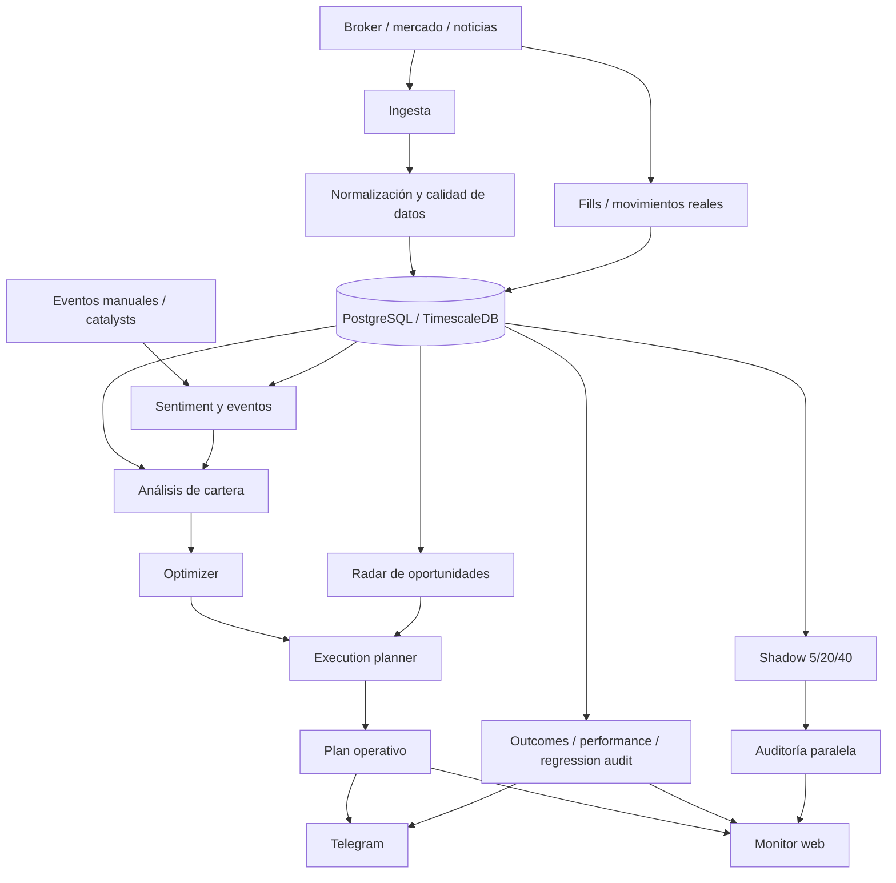

# Quantia

Quantia es un sistema personal de análisis financiero que convierte datos de mercado, cartera, noticias y ejecuciones reales en decisiones auditables. No ejecuta órdenes automáticamente. Observa, analiza, propone, bloquea cuando faltan condiciones y mide resultados después.

El objetivo no es “predecir el mercado”. El objetivo es tomar mejores decisiones con datos trazables: saber qué precio se usó, qué señal justificó una idea, si la orden era ejecutable, qué fill real ocurrió y cómo maduró el outcome.

## Problema que resuelve

Operar una cartera manualmente tiene tres problemas concretos:

- las decisiones quedan dispersas entre intuición, capturas, noticias y precios del momento;
- una recomendación puede sonar correcta pero depender de datos viejos, falta de cash o una cantidad no operable;
- después de operar, suele faltar una auditoría clara entre lo que el sistema propuso, lo que la persona ejecutó y lo que pasó en precio.

Quantia organiza ese flujo completo. Separa análisis, decisión, ejecución y auditoría para evitar que una señal teórica se confunda con una operación real.

## Arquitectura

## Componentes principales

| Capa | Responsabilidad |
|---|---|
| Ingesta | Scraping autenticado, precios actuales, instrumentos, portfolio, movimientos y noticias. |
| Persistencia | Históricos de precios, snapshots de cartera, fills, decisiones, outcomes y auditorías. |
| Análisis | Señales técnicas, macro, riesgo, sentiment y síntesis por activo. |
| Optimizer | Propone pesos teóricos de cartera con Black-Litterman/PyPortfolioOpt cuando aplica. |
| Execution planner | Convierte teoría en acciones operables: nominales enteros, cash disponible, guards y bloqueos. |
| Radar | Busca oportunidades externas y swaps posibles contra holdings actuales. |
| Shadow | Proyecta tendencia de precio a 5, 20 y 40 ruedas como capa experimental separada. |
| Eventos manuales | Permite cargar catalysts conocidos, como earnings o eventos binarios, que el precio todavía no explica solo. |
| Auditoría | Compara planes, fills reales, decisiones humanas, outcomes, edge y regresión de señales. |
| Interfaces | Bot de Telegram para operación diaria y monitor web read-only para control del sistema. |

## Escala operativa

En una corrida real reciente, el radar procesó **313 tickers**, filtró **136** por screener y rankeó **84 ideas** antes de mostrar el top operativo. El scheduler ejecuta más de **10 jobs programados** por rueda hábil, incluyendo apertura, monitoreo intradía, alertas pre-cierre, scrape EOD, análisis, shadow y outcomes. La suite focalizada actual cubre **50 tests** sobre planner, cash, shadow, sentiment, eventos manuales y guards defensivos.

## Stack técnico

- Python como lenguaje principal.
- Playwright, requests, aiohttp, httpx y BeautifulSoup para scraping e ingesta.
- PostgreSQL/TimescaleDB como base operacional e histórica.
- pandas, numpy, scipy, statsmodels, scikit-learn y `ta` para análisis cuantitativo.
- PyPortfolioOpt para optimización de cartera.
- yfinance y fuentes RSS/noticias para contexto externo.
- Ollama + modelos locales para análisis de sentiment y revisión causal.
- APScheduler para jobs de mercado, intradía, EOD y auditorías.
- Redis para cache/estado de runtime.
- python-telegram-bot como interfaz conversacional.
- aiohttp + HTML/CSS/JS para monitor web read-only.
- Docker Compose para levantar scheduler, bot, monitor y base local opcional.

## Decisiones de diseño

### 1. Separar señal, decisión y ejecución

Un score positivo no se transforma en compra. Primero pasa por efectivo disponible, tamaño mínimo, nominales enteros, precio fresco, concentración y guards de calidad. Esta separación evita que el sistema recomiende operaciones imposibles o confunda rebalanceo con tesis direccional.

### 2. Usar fills reales como fuente de verdad

La performance no se calcula sobre planes ideales. El sistema distingue `decision_log`, movimientos del broker, fills reconciliados y outcomes maduros. Una idea puede ser útil como auditoría, pero no entra al EV operativo hasta que exista ejecución real.

### 3. Mantener capas experimentales fuera del planner

Shadow, causal analysis, radar audit y pre-close alerts aportan contexto, pero no cambian el motor principal salvo que una regla se promueva de forma explícita. Esto permite investigar señales nuevas sin contaminar la lógica operativa.

### 4. Priorizar honestidad de datos

El sistema marca precios stale, históricos insuficientes, snapshots parciales, tickers no evaluables y cobertura incompleta. Prefiere bloquear o degradar una idea antes que completar huecos con supuestos silenciosos.

### 5. Diseñar para operación diaria

Telegram resuelve el uso rápido: portfolio, análisis, radar, shadow, performance y alertas. El monitor resuelve la lectura de sistema: salud de ingesta, outcomes, radar audit, decision intelligence, fills, candles y confianza operativa.

## Qué aprendí construyéndolo

Los bugs de producción cambiaron el diseño más que los indicadores.

- Un bug en `price_at_decision` mostró que una decisión sin precio confiable contamina todos los outcomes posteriores. La solución fue tomar el precio desde la referencia de la orden cuando existe, y completar desde el fill real si la decisión llega incompleta.
- Las ventas generadas solo por rebalanceo podían sonar como tesis bajista. Separé venta operativa, rebalanceo, vigilancia y bloqueo para que el texto no prometa una causalidad que el sistema no probó.
- Black-Litterman puede devolver pesos teóricos agresivos o infeasible. Por eso el optimizer no decide órdenes: el execution planner vuelve a validar cash, nominales, concentración, precio fresco y guards.
- Radar puede detectar momentum tarde. Shadow y radar audit quedaron como capas separadas para medir si una idea siguió a favor o fue ruido de corto plazo.

El proyecto pasó de ser un bot de señales a un sistema de decisión con trazabilidad porque cada capa tiene un contrato: qué dato acepta, qué puede decidir y cuándo debe abstenerse.

## Estado actual

Quantia corre en producción local con jobs programados, bot de Telegram, monitor web y base persistente. Ya procesa cartera, mercado, radar, shadow, noticias, fills y outcomes. El sistema sigue en evolución: las capas experimentales acumulan muestra antes de modificar decisiones principales.

## Límites

- No es asesoramiento financiero.
- No ejecuta trades automáticamente.
- No garantiza resultados.
- No trata una predicción como verdad.
- No considera una señal válida si los datos no pasan controles básicos.

## Por qué este proyecto importa en mi perfil

Quantia resume el tipo de software que quiero construir: Python, datos, automatización, scraping, persistencia, análisis cuantitativo, IA aplicada, monitoreo y operación real. Es un proyecto con producto, arquitectura, errores de producción, validación y decisiones técnicas defendibles.
