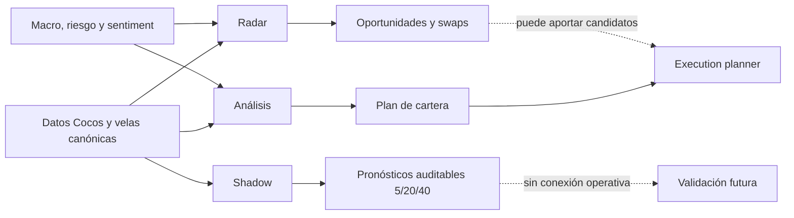

# Cómo analizan Análisis, Radar y Shadow

## Propósito

Cocos Copilot tiene tres módulos que miran el mercado desde preguntas distintas:

| Módulo | Pregunta que responde |
|---|---|
| **Análisis** | ¿Qué conviene hacer con la cartera actual? |
| **Radar** | ¿Qué activos externos podrían mejorar la cartera? |
| **Shadow** | ¿Qué dirección de precio sugiere la tendencia para 5, 20 y 40 ruedas? |

No deben leerse como tres votos sobre la misma decisión. Cada módulo usa datos,
reglas y objetivos diferentes.

## Datos comunes

Los tres módulos parten de datos internos del proyecto:

- `portfolio_snapshots` y `positions`: cartera, cantidades, precios y efectivo;
- `market_prices`: último precio observado y universo disponible en Cocos;
- `market_candles`: velas históricas canónicas por activo;
- calendario de mercado: distingue ruedas hábiles, feriados y fines de semana.

La prioridad es trabajar con precios comparables de Cocos. Un activo sin
histórico suficiente se omite o se marca como no evaluable; no se completa con
una predicción inventada.

---

## 1. Análisis

### Objetivo

`scripts/run_analysis.py` analiza la cartera actual y construye un plan. Su
salida puede ser `HOLD`, compra, venta parcial, venta total, vigilancia o
bloqueo, pero el sistema no envía órdenes al broker.

### Flujo

1. **Carga la cartera**
   - posiciones actuales;
   - cantidad de nominales;
   - valor de mercado;
   - efectivo disponible;
   - concentración de cada posición.

2. **Carga velas canónicas**
   - usa el histórico local de `market_candles`;
   - requiere al menos 60 velas para el análisis técnico operativo;
   - si no existe histórico suficiente, el holding queda como `NO_EVALUABLE`.

3. **Calcula la capa técnica**
   - tendencia y alineación de medias;
   - ADX y dirección `DI+ / DI-`;
   - MACD;
   - RSI, estocástico y Williams %R;
   - volatilidad, ATR y estructura del precio;
   - régimen por ticker: tendencia fuerte, rango, bajista o transición.

4. **Calcula macro y régimen de mercado**
   - índices internacionales;
   - VIX;
   - tasas, dólar, petróleo y variables argentinas disponibles;
   - clasifica el contexto como normal, cauteloso o defensivo.

5. **Calcula riesgo de cartera**
   - concentración;
   - volatilidad;
   - drawdown;
   - exposición total y efectivo;
   - advertencias específicas por posición.

6. **Agrega sentiment**
   - utiliza noticias y eventos agregados por ticker o contexto macro;
   - pondera el score por confianza de la fuente;
   - si no hay sentiment activo, no lo interpreta como una señal positiva;
   - la ingesta continúa fuera de rueda, aunque el plan operativo no cambie.

7. **Combina las capas**

La configuración actual del score es:

| Capa | Peso base |
|---|---:|
| Técnico | 30% |
| Macro | 30% |
| Riesgo | 25% |
| Sentiment | 15% |

El resultado es un `final_score` entre -1 y +1. Ese número es una síntesis de
señales; **no es una probabilidad de ganar ni un retorno esperado**.

8. **Pasa por el risk gate y el optimizer**
   - el risk gate define si el contexto permite asumir riesgo;
   - el optimizer propone pesos objetivo;
   - intenta Black-Litterman cuando está disponible;
   - si no converge, usa un fallback explícito;
   - el optimizer propone distribución, pero no decide por sí solo qué orden es
     ejecutable.

9. **Pasa por el execution planner**
   - verifica señal, riesgo, efectivo y precio actual;
   - convierte montos teóricos en nominales enteros;
   - una venta libera efectivo antes de evaluar compras encadenadas;
   - puede bloquear una idea del optimizer;
   - evita vender una tendencia fuerte sólo por rebalanceo cuando se activa el
     guard defensivo correspondiente.

### Qué entrega

- plan de cartera;
- pesos actuales y objetivo;
- cantidades enteras estimadas;
- motivos de compra, venta, vigilancia o bloqueo;
- registro auditable en `decision_log` cuando la corrida es formal.

### Qué no significa

- `SELL` por rebalanceo no implica necesariamente una predicción bajista;
- `BUY` puede depender de efectivo, concentración y tamaño mínimo;
- un score positivo no garantiza que el activo suba;
- fuera de rueda, el análisis manual queda en modo exploratorio y no persiste
  un nuevo plan operativo.

En Telegram se abre con **Plan de cartera** o `/analisis`.

---

## 2. Radar

### Objetivo

`scripts/run_opportunity.py` busca activos del universo Cocos que todavía no
están en cartera. Su pregunta no es “¿subirá?”, sino “¿existe un setup externo
que justifique vigilar una entrada o reemplazar una posición actual?”.

### Flujo

1. **Construye el universo**
   - toma los activos vigentes de `market_prices`;
   - excluye holdings por defecto;
   - usa solamente históricos canónicos disponibles.

2. **Aplica un screener inicial**
   - disponibilidad y calidad de velas;
   - precio y liquidez;
   - momentum de 20 y 60 ruedas;
   - fuerza relativa;
   - volatilidad;
   - estructura de tendencia.

Los activos que no pasan este filtro no consumen el resto del análisis.

3. **Calcula un score comparable**
   - reutiliza técnico, macro, riesgo contextual y sentiment;
   - el score de síntesis representa el 80%;
   - el momentum específico del screener representa el 20%.

4. **Calcula asimetría y riesgo/retorno**
   - estima zona de entrada;
   - usa ATR y estructura para stop e invalidación;
   - estima upside, downside y relación riesgo/retorno;
   - una buena tendencia con mala asimetría puede quedar sólo en vigilancia.

5. **Compara contra la cartera**
   - identifica holdings con los que compite;
   - calcula si el candidato tiene edge relativo;
   - si mejora una posición existente, puede aparecer como candidato a swap;
   - no considera que vender y comprar sean acciones independientes: primero
     debe liberarse capital y luego comprarse una cantidad entera.

6. **Aplica restricciones de efectivo**
   - con efectivo suficiente puede habilitar una compra;
   - sin efectivo ejecutable, baja la idea a vigilancia;
   - informa “requiere funding o swap” en vez de presentar una compra imposible.

### Estados principales

| Estado | Lectura correcta |
|---|---|
| `COMPRABLE_AHORA` | Cumple score, convicción, R/R, edge y gate. Debe revalidarse al abrir. |
| `COMPRA_HABILITADA` | Cumple mínimos, pero no es prioritaria. |
| `SWAP_CANDIDATO` | Puede mejorar un holding si primero se libera capital. |
| `VIGILANCIA_A` | Setup cercano; falta una confirmación importante. |
| `VIGILANCIA_B` | Tiene edge, pero la entrada o asimetría no está completa. |
| `VIGILANCIA_C` | Sólo observación. |
| `DESCARTAR` | No supera los mínimos. |

### Qué entrega

- ranking de oportunidades;
- score y convicción;
- relación riesgo/retorno;
- zona de entrada e invalidación;
- comparación contra holdings;
- necesidad de efectivo o swap.

### Qué no significa

- estar primero en el ranking no equivale a una orden de compra;
- “requiere funding” significa que no existe efectivo suficiente en ese momento;
- el radar de Telegram es exploratorio y corre con `--no-persist`;
- una idea del radar sólo pasa a la capa operativa si el planner puede financiarla
  y convertirla en nominales reales.

En Telegram se abre con **Radar** o `/radar`.

---

## 3. Shadow

### Objetivo

`scripts/run_thesis_shadow.py` es un experimento independiente. Intenta medir si
la tendencia histórica permite pronosticar dirección y retorno a 5, 20 y 40
ruedas.

Su función actual es producir hipótesis medibles. No modifica el score de
Análisis, el Radar, el optimizer, el planner ni las órdenes.

### Datos que utiliza

El modelo `price_trend_ensemble_v1` usa exclusivamente precios de cierre
canónicos:

- mínimo de 80 ruedas por activo;
- retornos logarítmicos;
- ventanas de tendencia de 20, 60 y 120 ruedas;
- volatilidad observada en las últimas 60 ruedas;
- exclusión de series cuya última vela tenga más de 7 días de atraso respecto
  de la serie más fresca de la corrida.

No usa macro, sentiment, concentración, efectivo ni decisiones previas. Esa
separación permite saber si el precio por sí solo aporta capacidad predictiva.

### Cómo construye el pronóstico

1. Ajusta una tendencia lineal sobre el logaritmo del precio en cada ventana.
2. Calcula el `R²` de cada tendencia.
3. Reduce el peso de tendencias inestables o con bajo ajuste.
4. Combina las tres ventanas de forma distinta según el horizonte:

| Horizonte | Ventana 20 | Ventana 60 | Ventana 120 |
|---|---:|---:|---:|
| 5 ruedas | 50% | 35% | 15% |
| 20 ruedas | 25% | 45% | 30% |
| 40 ruedas | 15% | 35% | 50% |

5. Estima incertidumbre combinando:
   - volatilidad diaria;
   - horizonte temporal;
   - desacuerdo entre las tres ventanas.
6. Convierte retorno esperado e incertidumbre en una probabilidad de terminar
   positivo.

### Cómo clasifica

El horizonte principal para la tesis es 20 ruedas, confirmado por 40 ruedas.

Para una posición actual:

| Estado | Regla resumida |
|---|---|
| `HOLD` | Retorno esperado a 20r ≥ 1,5%, probabilidad positiva a 20r ≥ 58% y 40r ≥ 52%. |
| `EXIT_WATCH` | Retorno esperado a 20r ≤ -1,5%, probabilidad positiva a 20r ≤ 42% y 40r ≤ 48%. |
| `REVIEW` | No existe confirmación suficiente en ninguna dirección. |

Para un candidato:

| Estado | Lectura |
|---|---|
| `ENTRY_WATCH` | La tendencia supera la regla positiva; sólo vigilar entrada. |
| `AVOID` | La tendencia supera la regla negativa; evitar por ahora. |
| `ABSTAIN` | No hay señal suficiente. |

### Persistencia y validación

Shadow usa tablas propias:

- `shadow_thesis_runs`;
- `shadow_thesis_forecasts`;
- `shadow_thesis_outcomes`.

Cada pronóstico conserva versión, fecha de corte, precio de referencia,
horizonte, retorno esperado, probabilidad, intervalo de incertidumbre y features.

Los outcomes maduran por **ruedas posteriores reales**, no por días calendario:

- después de 5 ruedas se evalúa el horizonte corto;
- después de 20 ruedas, el horizonte principal;
- después de 40 ruedas, la tesis larga.

La evaluación informa, entre otras métricas:

- acierto de dirección;
- error absoluto medio;
- retorno esperado frente a retorno observado;
- cantidad de muestras maduras.

### Operación

- el scheduler genera una corrida a las **17:18 ART** en días hábiles;
- el botón **Shadow** y `/shadow` leen la última corrida persistida;
- abrir el reporte no recalcula ni guarda forecasts;
- Shadow no escribe ninguna fila en `decision_log`.

### Limitación actual

Las cifras de retorno son extrapolaciones de tendencia, no objetivos de precio.
Valores altos —por ejemplo, +40% o +80%— deben considerarse hipótesis agresivas
hasta comprobar su calibración. El módulo todavía necesita acumular outcomes de
5, 20 y 40 ruedas antes de decidir si aporta señal real.

---

## Comparación directa

| Característica | Análisis | Radar | Shadow |
|---|---|---|---|
| Universo | Cartera actual | Activos fuera de cartera | Cartera y candidatos |
| Técnico | Sí | Sí | Tendencia de precios independiente |
| Macro | Sí | Sí | No |
| Riesgo de cartera | Sí | Contextual | No |
| Sentiment | Sí | Sí | No |
| Efectivo/funding | Sí | Sí | No |
| Optimización de pesos | Sí | No | No |
| Predicción 5/20/40 | No explícita | No explícita | Sí |
| Puede alimentar un plan | Sí, mediante planner | Sólo como candidato | No |
| Persiste en `decision_log` | Corrida formal | No desde Telegram | Nunca |
| Tabla propia de outcomes | Usa outcomes operativos | Usa auditoría separada | Sí |

## Cómo interpretar diferencias entre módulos

### Caso: Análisis dice vender y Shadow dice mantener

No es necesariamente una contradicción:

- Análisis puede vender por concentración, riesgo o rebalanceo;
- Shadow puede mantener porque la tendencia de precio sigue positiva.

La lectura correcta es: “la cartera está concentrada, pero no hay evidencia
bajista de precio”. Esa diferencia debe mostrarse, no ocultarse.

### Caso: Radar propone comprar, pero falta funding

Significa que el activo pasó filtros de oportunidad, pero la cartera no tiene
efectivo suficiente. La operación sólo sería posible mediante:

- una venta financiadora;
- un swap contra un holding peor;
- nuevo efectivo.

### Caso: Shadow proyecta una suba muy alta

No debe convertirse automáticamente en compra. Primero debe demostrar que:

- acierta dirección fuera de muestra;
- no sobreestima retornos;
- conserva payoff positivo después de costos;
- funciona en más de un régimen de mercado.

## Accesos rápidos

| Vista | Telegram | CLI |
|---|---|---|
| Análisis | Botón **Plan de cartera** o `/analisis` | `python scripts/run_analysis.py` |
| Radar | Botón **Radar** o `/radar` | `python scripts/run_opportunity.py` |
| Shadow | Botón **Shadow** o `/shadow` | `python scripts/run_thesis_shadow.py --latest-report --telegram-format` |

## Archivos principales

| Módulo | Archivos |
|---|---|
| Análisis | `scripts/run_analysis.py`, `src/analysis/synthesis.py`, `src/analysis/optimizer.py`, `src/analysis/execution_planner.py` |
| Radar | `scripts/run_opportunity.py`, `src/analysis/opportunity_screener.py` |
| Shadow | `scripts/run_thesis_shadow.py`, `src/analysis/thesis_shadow.py`, `src/analysis/thesis_shadow_store.py` |
