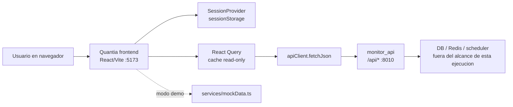
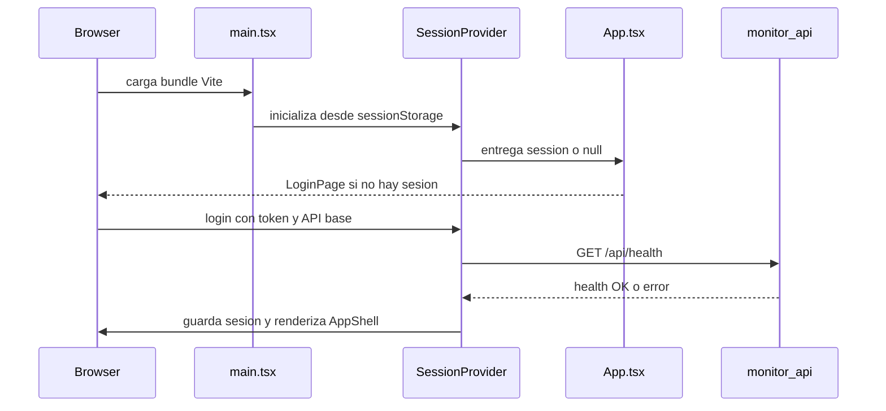

# Arquitectura del frontend de Quantia

Fecha de relevamiento: 2026-08-01

Alcance: frontend React en `frontend/`. La arquitectura del backend queda para la siguiente ejecucion, como pidio el usuario.

## Resumen ejecutivo

El frontend de Quantia es una SPA read-only construida con React, TypeScript y Vite. Su funcion es exponer el estado operativo del sistema cuantitativo: cartera, decisiones, performance, auditoria, datos, radar y comparacion bot-vs-humano. No ejecuta ordenes, no cambia thresholds y no modifica decisiones del planner.

El contrato central es:

```text
Browser SPA -> React Query hooks -> monitorApi -> monitor_api HTTP API
```

Los datos productivos vienen de `monitor_api` en el puerto `8010`. El frontend corre en el puerto `5173` y, por defecto, calcula la base de API como `http://<host-actual>:8010`. Esto permite usarlo en `localhost` y en un hostname privado como Tailscale cuando el backend acepta el origen.

## Limite del sistema



El frontend no tiene una base propia, no persiste entidades de negocio y no contiene logica de decision cuantitativa. Su estado local se limita a sesion, filtros, periodo de consulta y cache de queries.

## Stack confirmado

| Area | Evidencia | Lectura |
|---|---|---|
| Framework UI | `frontend/package.json` | React `18.3.1` y React DOM `18.3.1`. |
| Lenguaje | `frontend/tsconfig.json`, `frontend/src/**/*.tsx` | TypeScript con componentes TSX. |
| Build | `frontend/package.json`, `frontend/vite.config.ts` | Vite con plugin React, host `0.0.0.0`, puerto `5173`. |
| Routing | `frontend/src/app/App.tsx` | `react-router-dom` con rutas lazy-loaded. |
| Data fetching | `frontend/src/main.tsx`, `frontend/src/hooks/useMonitorData.ts` | TanStack React Query, `staleTime` 30s, `retry` 1, sin refetch al enfocar ventana. |
| Iconos | `frontend/src/components/layout/AppShell.tsx` | `lucide-react` para navegacion y acciones. |
| Estilos | `frontend/src/styles.css`, `frontend/tailwind.config.js` | CSS propio con tokens; Tailwind configurado pero el estilo principal esta en CSS global. |
| Servido productivo | `frontend/Dockerfile`, `docker-compose.yml` | Build multi-stage Node 22 Alpine y `sirv` sobre `dist`. |

## Estructura de codigo

| Carpeta / archivo | Responsabilidad |
|---|---|
| `frontend/src/main.tsx` | Crea el root React y envuelve la app con `QueryClientProvider`, `SessionProvider` y `BrowserRouter`. |
| `frontend/src/app/App.tsx` | Decide login vs app autenticada, define rutas y carga paginas con `lazy` + `Suspense`. |
| `frontend/src/app/session.tsx` | Administra sesion `api`/`demo`, token, TOTP opcional, base URL y persistencia en `sessionStorage`. |
| `frontend/src/components/layout/AppShell.tsx` | Marco comun: header, estado del sistema, navegacion, boton actualizar, logout y footer. |
| `frontend/src/hooks/useMonitorData.ts` | Fachada de datos: hooks por dominio, cache keys, modo demo y parametro `period`. |
| `frontend/src/services/apiClient.ts` | HTTP client con `Authorization: Bearer`, `X-TOTP-Code`, timeout y errores normalizados. |
| `frontend/src/services/monitorApi.ts` | Lista de endpoints consumidos por la SPA. |
| `frontend/src/services/mockData.ts` | Payloads demo para usar la UI sin backend real. |
| `frontend/src/types/api.ts` | Tipos de payloads por endpoint y `RowRecord` para campos dinamicos. |
| `frontend/src/utils/*.ts` | Normalizacion de datos, labels y formatos numericos/fecha. |
| `frontend/src/components/ui/*.tsx` | Primitivas visuales: metricas, paneles, badges, tablas. |
| `frontend/src/components/charts/MiniCharts.tsx` | SVG charts simples: linea, barras horizontales y dispersion. |
| `frontend/src/pages/*.tsx` | Paginas de producto, cada una conectada a hooks del monitor. |

## Flujo de arranque



## Rutas y paginas

| Ruta | Pagina | Hooks principales | Proposito |
|---|---|---|---|
| `/` | `OverviewPage` | `useHealthQuery`, `useIngestionQuery`, `usePortfolioQuery(90)`, `useDecisionsQuery(90)`, `usePerformanceQuery(180)`, `useOverrideQuery(90)`, `useRadarQuery(90)`, `useFillsQuery(90)` | Vista ejecutiva de cartera, riesgos, accion prioritaria y actividad reciente. |
| `/cartera` | `PortfolioPage` | `usePortfolioQuery(90)` | Posiciones, efectivo, P/L, exposicion y snapshot. |
| `/analisis` | `AnalysisPage` | `usePerformanceQuery(180)`, `useDecisionsQuery(90)`, `useShadowQuery`, `useCandlesQuery` | Lectura explicada de seniales, contexto tecnico y evidencia reciente. |
| `/oportunidades` | `OpportunitiesPage` | `useRadarQuery(90)` | Radar teorico y bloqueado, separado de acciones operables. |
| `/decisiones` | `DecisionsPage` | `useDecisionsQuery(90)`, `useOverrideQuery(90)` | Ciclo de decision auditable: sugerencia, planner, aprobacion, ejecucion o bloqueo. |
| `/performance` | `PerformancePage` | `usePerformanceQuery(period)` | Intel operativo, score points, fuentes, seniales, tickers y planes recientes. |
| `/bot-vs-humano` | `HumanBenchmarkPage` | `useOverrideQuery(90)`, `useHumanQuery(7)` | Comparacion observada entre planes del bot y movimientos humanos. |
| `/auditoria` | `AuditPage` | `useDecisionsQuery(90)`, `usePerformanceQuery(180)`, `useLogsQuery` | Trazabilidad de metricas, estados y eventos tecnicos. |
| `/datos` | `DataPage` | `useHealthQuery`, `useIngestionQuery`, `useCandlesQuery`, `useLogsQuery`, `usePeriodParam` | Frescura, cobertura, endpoints y logs. |

## Contrato con la API

`frontend/src/services/monitorApi.ts` centraliza los endpoints usados:

| Key | Path |
|---|---|
| `auth` | `/api/auth/status` |
| `health` | `/api/health` |
| `ingestion` | `/api/ingestion` |
| `candles` | `/api/candles` |
| `decisions` | `/api/decisions?days=<n>` |
| `portfolio` | `/api/portfolio?days=<n>` |
| `performance` | `/api/performance?days=<n>` |
| `override` | `/api/override-audit?days=<n>` |
| `ledger` | `/api/decision-ledger?days=<n>` |
| `timeline` | `/api/audit-timeline?days=<n>&limit=<n>` |
| `radar` | `/api/radar-audit?days=<n>` |
| `shadow` | `/api/shadow` |
| `human` | `/api/human-activity?days=<n>` |
| `fills` | `/api/fills?days=<n>` |
| `logs` | `/api/logs/recent?limit=80` |

El cliente HTTP esta en `frontend/src/services/apiClient.ts`. Para sesiones `api`, envia:

- `Authorization: Bearer <token>`
- `X-TOTP-Code: <codigo>` solo si el usuario lo cargo
- timeout con `AbortController`

El modo `demo` evita la red y devuelve copias de `frontend/src/services/mockData.ts`.

## Estado, cache y filtros

React Query se configura en `frontend/src/main.tsx` con:

- `staleTime: 30000`
- `retry: 1`
- `refetchOnWindowFocus: false`

Los hooks de `frontend/src/hooks/useMonitorData.ts` usan query keys con la forma:

```text
["monitor", key, session.mode, session.apiBase, ...params]
```

Esto evita mezclar datos entre modo demo, API real y cambios de periodo. Los filtros de periodo usan `usePeriodParam`, que escribe `period` en la URL. La pagina de performance agrega filtros URL para `vista`, `alcance` y `accion`.

## Modelo de presentacion

El frontend separa tres niveles:

1. `services`: contratos HTTP y payloads.
2. `hooks`: seleccion de fuente, cache y parametros.
3. `pages`: lectura de negocio, metricas, tablas y graficos.

Las paginas consumen `RowRecord` mediante helpers defensivos de `frontend/src/utils/data.ts`:

- `asRows`
- `getRecord`
- `getString`
- `getNumber`
- `getBoolean`
- `nestedNumber`

Esto reduce fallas cuando un campo viene ausente o con tipo variable desde la API.

## Componentes compartidos

| Componente | Archivo | Uso |
|---|---|---|
| `Metric` / `MetricGroup` | `frontend/src/components/ui/Metric.tsx` | KPIs de alto nivel. |
| `Panel` | `frontend/src/components/ui/Panel.tsx` | Secciones con kicker, titulo y accion opcional. |
| `ResponsiveTable` | `frontend/src/components/ui/ResponsiveTable.tsx` | Tablas con columnas declarativas, sort opcional y modo responsive. |
| `StatusBadge` | `frontend/src/components/ui/StatusBadge.tsx` | Estados visuales por tono. |
| `LoadingState`, `ErrorState`, `EmptyState`, `SkeletonBlock` | `frontend/src/components/feedback/States.tsx` | Estados de carga, error, vacio y skeleton. |
| `LineChart`, `HorizontalBars`, `ScatterChart` | `frontend/src/components/charts/MiniCharts.tsx` | Graficos SVG livianos sin dependencia pesada de charting. |
| `DataFreshness` | `frontend/src/components/ui/DataFreshness.tsx` | Lectura de fechas/frescura de datos. |

## Decision de diseno

`frontend/DESIGN.md` define la interfaz como una superficie de auditoria, no como dashboard comercial. La implementacion actual sigue esa idea con:

- layout denso y escaneable;
- tokens oscuros sobrios en `frontend/src/styles.css`;
- tipografia separada para display, texto y datos monoespaciados;
- badges para distinguir real, teorico, bloqueado, warning e info;
- tablas como formato principal para trazabilidad;
- charts pequenos para apoyar lectura, no para esconder la evidencia.

La mejora reciente de `PerformancePage` mantiene la frontera entre:

- `primary`: metrica principal basada en ejecuciones reales validadas;
- `planner_audit`: planes del bot auditados;
- `radar_audit`: ideas teoricas;
- `blocked_audit`: decisiones bloqueadas.

Esto es importante porque el EV agregado no debe tratarse como edge del bot si mezcla movimientos manuales con planes ejecutados.

## Empaquetado y despliegue local

`frontend/Dockerfile` usa dos etapas:

1. `build`: instala dependencias y ejecuta `npm run build`.
2. `serve`: instala dependencias productivas y sirve `dist` con `sirv`.

`docker-compose.yml` define el servicio:

```yaml
frontend:
  build:
    context: ./frontend
    args:
      VITE_MONITOR_API_BASE_URL: ${VITE_MONITOR_API_BASE_URL:-auto}
  container_name: quantia_frontend
  restart: unless-stopped
  depends_on:
    - monitor_api
  ports:
    - "${FRONTEND_PORT:-5173}:5173"
```

URL local esperada:

```text
http://localhost:5173/
```

Si se abre desde un hostname Tailscale, el frontend infiere la API como:

```text
http://<hostname-tailscale>:8010
```

Requisito: el backend debe aceptar ese origen via CORS o misma combinacion host/puerto permitida.

## Seguridad del frontend

Confirmado en codigo:

- El token del monitor se guarda en `sessionStorage`, no en `localStorage`.
- El logout elimina la clave `quantia:frontend:session`.
- El frontend no expone endpoints de escritura.
- El token se manda como bearer token solo contra `session.apiBase`.
- TOTP es opcional y viaja en `X-TOTP-Code`.

Pendiente de validar:

- Politica de expiracion/rotacion del token.
- Hardening de headers del servidor `sirv`.
- Manejo de roles si en el futuro hay mas de un usuario.
- Proteccion extra si se publica fuera de red privada.

## Calidad y validacion

Comandos relevantes:

```powershell
cd C:\Users\Franco\OneDrive\Escritorio\backend\cocos_copilot\frontend
npm run build
npm run lint
```

Validacion ejecutada en esta iteracion de frontend:

- `npm run build`: OK.
- `npm run lint`: OK.
- `docker compose up -d --build frontend`: OK.
- Smoke Playwright sobre `/performance` en vistas `score`, `fuentes`, `tickers` y `recientes`: OK, sin errores de consola y sin overflow horizontal.

Capturas generadas:

- `outputs/playwright/quantia-intel-desktop.png`
- `outputs/playwright/quantia-intel-mobile.png`

## Gaps y riesgos

| Gap | Impacto | Estado |
|---|---|---|
| Tipos flexibles con `RowRecord` | Da resiliencia frente a payloads cambiantes, pero reduce chequeo estatico de columnas reales. | Confirmado. |
| Sin test unitario de componentes | Cambios visuales dependen de build/lint/smoke manual o Playwright ad hoc. | Pendiente de validar. |
| Sin E2E formal versionado | Los smokes existen como ejecuciones, no como suite estable en `frontend/tests`. | Pendiente de validar. |
| Dependencias productivas del frontend | `npm audit --omit=dev` ejecutado el 2026-08-08: 0 vulnerabilidades. | Validado; volver a auditar al actualizar dependencias. |
| Acceso remoto depende de CORS, Tailscale y API token | El frontend puede funcionar, pero la conectividad real depende de red y backend. | Confirmado por arquitectura; estado externo variable. |
| No hay i18n formal | Textos estan embebidos en componentes. | Confirmado. |

## Recomendaciones proximas

1. Crear una suite Playwright versionada para rutas principales: `/`, `/cartera`, `/decisiones`, `/performance`, `/datos`.
2. Endurecer tipos de payloads mas usados: `PortfolioPayload.positions`, `PerformancePayload.score_points`, `DecisionsPayload.recent`.
3. Agregar una pagina tecnica liviana de contrato API que lea `endpointDefinitions(period)` y permita copiar endpoint, metodo y timeout.
4. Mantener cualquier decision de bot fuera del frontend: el UI debe seguir siendo lectura y auditoria.

## Como exportar

Fuente editable:

```text
docs/08-frontend-arquitectura.md
```

Copia HTML autonoma:

```text
docs/export/quantia-frontend-arquitectura.html
```

Para PDF, abrir el HTML en el navegador y usar imprimir / guardar como PDF.
