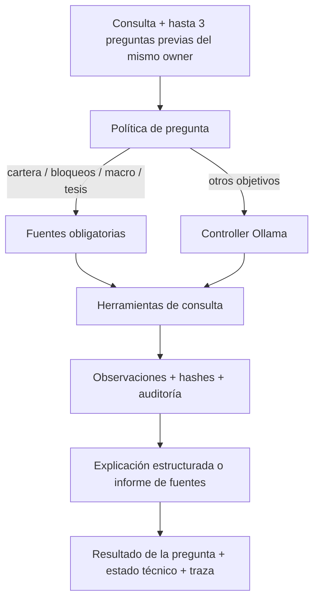

# 15 — Loop agéntico de Quantia

## Objetivo

Esta capa consulta evidencia con límites de tiempo, cuenta y herramientas. Las
preguntas reconocidas de cartera, bloqueos, CEDEAR y tesis de mercado siguen una
política de fuentes obligatorias y una explicación determinística. Para otros
objetivos, Ollama selecciona las herramientas y el cierre presenta sus fuentes.
Ninguna de las dos rutas certifica que una estrategia tenga ventaja económica.



## Frontera de autoridad

El agente **puede** decidir qué evidencia consultar y en qué orden. Puede invocar
análisis de cartera, análisis puntual, macro, radar y performance.

El agente **no puede**:

- ejecutar órdenes;
- escribir `decision_log`;
- cambiar pesos;
- reemplazar optimizer o planner;
- cambiar thresholds;
- saltear risk guards;
- llamar tools no registradas.

`ToolRegistry` rechaza directamente cualquier tool marcada `read_only=False`.

Los análisis financieros reutilizan pipelines existentes:

- `run_analysis.py` siempre se llama con `--no-persist --no-telegram --no-llm`;
- `run_opportunity.py` siempre se llama con `--no-persist --no-telegram`;
- el controlador aplica las fuentes obligatorias; fuera de esos casos Ollama decide el siguiente paso.

El LLM puede seleccionar herramientas para consultas generales. El texto financiero
publicado se deriva de evidencia, y el motor cuantitativo conserva sus decisiones.

## Archivos

- `src/agentic/contracts.py`: contratos de decisiones, tools, observaciones y resultado.
- `src/agentic/model.py`: controlador Ollama JSON-only.
- `src/agentic/answer.py`: cierre descriptivo para consultas generales.
- `src/agentic/diagnostics.py`: fuentes requeridas y explicaciones por tipo de pregunta.
- `src/agentic/analysis_export.py`: proyección JSON de objetos existentes del planner.
- `src/agentic/tools.py`: registry + tools read-only.
- `src/agentic/orchestrator.py`: loop, límites, cache y anti-loop.
- `src/agentic/persistence.py`: auditoría en `agent_runs` y `agent_steps`.
- `scripts/run_agent.py`: CLI de producción.
- `src/agentic/read_only.py` y `read_only_runner.py`: protección de conexiones y procesos de evidencia.
- `tests/test_agentic_loop.py`: contrato del loop y guards.

## Tools iniciales

| Tool | Fuente | Side effect financiero |
|---|---|---|
| `get_portfolio_snapshot` | `PortfolioDatabase.get_latest_snapshot()` | ninguno |
| `get_macro_context` | `fetch_macro()` | ninguno |
| `get_macro_exposure` | mapa macro y evaluación aislada de la regla Argentina | ninguno |
| `get_decision_evidence` | `run_analysis.py --agent-json` con guards de consulta | ninguno |
| `analyze_portfolio` | `run_analysis.py --no-persist` | ninguno |
| `analyze_ticker` | `run_analysis.py --tickers ... --no-persist` | ninguno |
| `scan_opportunities` | `run_opportunity.py --no-persist` | ninguno |
| `get_performance` | SELECT de outcomes brutos guardados, por cuenta y cohorte | ninguno |

No existe tool de `BUY`, `SELL`, broker order, optimizer override o planner override.

## Auditoría

En el primer run se crean idempotentemente:

- `agent_runs`
- `agent_steps`

Cada paso guarda:

- tool y argumentos;
- rationale breve del controller;
- observación;
- SHA-256 de la observación;
- duración;
- error;
- cache/repetición;
- modelo;
- objetivo y stop reason.

Por defecto `QUANTIA_AGENT_REQUIRE_AUDIT=true`: si no puede persistir el audit,
el agente falla cerrado.

## Anti-loop

Controles activos:

1. `QUANTIA_AGENT_MAX_STEPS` (default 8; hard cap 20).
2. Una misma llamada exacta no puede ejecutarse dos veces.
3. Tool timeout.
4. Salida textual acotada; JSON estructurado inválido o mayor de 100.000 caracteres se rechaza, no se trunca como evidencia válida.
5. Finalización forzada al agotar el budget.
6. Tools desconocidas o argumentos fuera de schema se convierten en observaciones
   de error; nunca se ejecutan.

## Prompt-injection / tool-output safety

El system prompt indica que una observación es **dato no confiable**, no
instrucción. El modelo no recibe herramientas de escritura, por lo que aunque
una noticia o reporte incluyera una instrucción maliciosa, no existe una
capacidad registrada para ejecutar un trade o modificar políticas.

## Variables

Copiar los valores relevantes de `.env.agentic.example`.

Producción recomendada:

```env
QUANTIA_AGENT_ENABLED=true
QUANTIA_AGENT_MODEL=qwen2.5:3b
QUANTIA_AGENT_MAX_STEPS=8
QUANTIA_AGENT_REQUIRE_AUDIT=true
```

## Smoke test antes de producción

Primero, tests:

```bash
python -m pytest tests/test_agentic_loop.py tests/test_agentic_guards.py -q
python -m py_compile \
  src/agentic/contracts.py \
  src/agentic/model.py \
  src/agentic/tools.py \
  src/agentic/persistence.py \
  src/agentic/orchestrator.py \
  scripts/run_agent.py
```

Luego verificar Ollama:

```bash
curl http://localhost:11434/api/tags
```

En Docker, conservar el host que ya usa Quantia para Ollama.

Run manual read-only:

```bash
python scripts/run_agent.py \
  --force \
  --goal "Evaluá si hoy existe una acción material que deba revisar en mi cartera."
```

Para inspeccionar toda la traza:

```bash
python scripts/run_agent.py \
  --force \
  --json \
  --goal "Revisá cartera, contexto macro y oportunidades externas sólo si hacen falta."
```

Verificación SQL:

```sql
SELECT id, goal, model, status, stop_reason, started_at, finished_at
FROM agent_runs
ORDER BY started_at DESC
LIMIT 5;

SELECT run_id, step_no, decision_kind, tool_name, observation_ok, elapsed_ms, error
FROM agent_steps
ORDER BY id DESC
LIMIT 30;
```

## Activación

El feature flag queda `false` por defecto. Para producción:

1. ejecutar los tests;
2. verificar Ollama;
3. ejecutar un run con `--force`;
4. revisar `agent_runs` / `agent_steps`;
5. recién entonces poner `QUANTIA_AGENT_ENABLED=true`.

No hace falta cambiar el scheduler ni el planner para habilitar el loop. El
rollout es **on-demand**, mediante CLI o Telegram. No se agregan ejecuciones
automáticas al scheduler.

## Correcciones de revisión para el despliegue

`run_performance.py` llama a `get_performance_stats_v2`, que cierra trades vencidos
y modifica `decision_log`. Por eso no se invoca desde este agente. La herramienta
usa SELECTs de outcomes existentes, separados por source/status/scope: no presenta
esos promedios sin deduplicar como EV neto, PnL económico ni prueba de edge.

Todas las conexiones de evidencia aplican `SET default_transaction_read_only=on`
y comprueban `SHOW transaction_read_only`. No alcanza con parámetros en la URL:
el servidor desplegado los sobreescribe durante la conexión. Los pools repiten la
protección en cada adquisición. Los scripts legacy se ejecutan en un proceso
aislado mediante `src.agentic.read_only_runner`, que sólo admite los dos scripts
registrados y exige los flags de no persistencia/no envío. La conexión de auditoría
queda separada y escribe únicamente `agent_runs` / `agent_steps`.

El owner es obligatorio. En multiusuario debe pasarse `--owner-chat-id`; en modo
single-user se resuelve desde el chat configurado. Nunca se usa owner null como
comodín global. Las herramientas de pipelines legacy requieren comprobar
que la DB contiene un único propietario, porque algunos de sus lectores auxiliares
todavía no están aislados por cuenta. En multiusuario se rechazan esas rutas;
snapshot, macro y outcomes permanecen disponibles con sus contratos propios.

Las llamadas se normalizan antes del anti-loop (ticker mayúscula y defaults),
los argumentos rechazan tipos incorrectos y la cancelación termina/recolecta el
subproceso. El hash corresponde al texto realmente observado, después del límite
de salida. Si falla algún paso de auditoría, `audit_persisted` nunca queda true.
Los pasos de auditoría no se sobrescriben mediante upsert. Una respuesta final
sin ninguna observación exitosa produce `FAILED`, no `COMPLETE`.

Desde el checkout operativo, una vez habilitado el flag en `.env` y recreado el
servicio que ejecuta la CLI:

```powershell
docker compose exec -T telegram_bot python scripts/run_agent.py --goal "Revisá mi cartera y explicá qué evidencia falta para decidir."
```

También está disponible bajo demanda en Telegram:

```text
/agente Revisá mi cartera y explicá qué evidencia falta para decidir.
```

Alias `/agent`, botón Auditoría → Agente. Exige un chat autorizado, fija el owner
al chat y entrega la respuesta más un JSON con la traza completa. Usa cuatro pasos
de herramientas como máximo, 240 segundos de presupuesto total y una consulta
simultánea por chat. El comando no usa `--force`; respeta el feature flag. La CLI
mantiene sus defaults (8 pasos, 600 segundos). `--output-json` evita truncar la
traza al transportarla por stdout. El timeout cancela el loop y sus herramientas.

No se agregan jobs automáticos. Ollama debe estar disponible con el modelo
configurado. Su disponibilidad no se considera una autorización financiera.

## Alcance del controlador

Las consultas soportadas tienen un recorrido de evidencia predefinido. El modelo
no puede saltárselo ni inventar una conclusión financiera. La selección dinámica
por Ollama queda disponible para objetivos generales. Este diseño favorece la
explicación verificable del sistema; no equivale a un analista financiero general.

## Validación del rollout — 2026-09-23

- Rama revisada: `feature/agentic-loop-orchestrator`; PR #1 contra `main`.
- Suite de integración local: **118 passed**. Incluye agente, guards, Analytics v2,
  viability, auditoría decision/market y menú de tickers. Es validación focalizada;
  no representa una certificación de toda la suite histórica.
- PostgreSQL real: una escritura sin filas (`UPDATE ... WHERE FALSE`) fue
  rechazada con `ReadOnlySQLTransactionError` en la conexión protegida.
- Ollama local `qwen2.5:3b` + DB: loop completo con snapshot, outcomes y macro,
  auditado con estado `COMPLETE` (run `efe268e5-f973-41b6-a4de-ddfb0582eefd`).
- Wrapper legacy: `analyze_ticker` completó sin persistencia ni envío
  (run `b1d3a934-1a11-4c54-946d-a633026e6c77`).
- Handler Telegram real + CLI/modelo/DB reales, con receptor simulado:
  `COMPLETE`, dos pasos, respuesta y documento JSON, archivos temporales limpios,
  owner e integridad de hashes contrastados contra `agent_runs`/`agent_steps`
  (run `8949f9b5-e74a-4bbd-aa3f-af6623d66567`). No se envió un mensaje de prueba al usuario.
- Despliegue: sólo se recreó `telegram_bot`, con feature flag y auditoría activados.
  `get_my_commands` confirmó `/agente` y la conservación de `/analytics`.
  Scheduler mantuvo el mismo container ID y hora de inicio.
- Imagen desplegada:
  `sha256:a2a0cbbd5b192c4dd234b6c87268fe2752e7ec49e8e433a2eb0fbb8d7c0fd037`.
  Se preservaron los cambios previos del checkout operativo; la rama del PR
  contiene únicamente el agente y su integración incremental con Telegram.

Comando de regresión utilizado en el checkout operativo:

```powershell
python -m pytest tests/test_agentic_loop.py tests/test_agentic_guards.py tests/test_analytics_v2.py tests/test_analytics_v2_telegram.py tests/test_viability_audit.py tests/test_decision_market_audit.py tests/test_ticker_telegram_menu.py -q
```

Los artefactos completos de smoke quedan locales bajo `tmp/agentic-review/` y
contienen evidencia privada de la cuenta; no se incorporan al repositorio.
El modelo puede fallar o llegar al límite de tiempo. En esos casos el comando
informa el estado y no transforma una respuesta incompleta en evidencia económica.

## Corrección del cierre — 2026-09-23

El run `6174e873-d2d7-461a-85c5-02437bcc3d13` consultó snapshot, macro, cartera
y NVDA. Al agotar cuatro consultas, el modelo respondió sólo `-0.063`, el score
de ese ticker. El contrato anterior aceptaba cualquier string no vacío; la
auditoría estaba completa, pero la respuesta no cumplía el objetivo.

La reproducción con Ollama también mostró errores al redactar libremente:
mezclaba WATCH/bloqueos con ventas y declaraba ausentes indicadores ya observados.
Por eso el cierre ahora usa `answer.py`, tanto cuando el modelo decide terminar
como al agotar consultas. El controlador conserva la elección de herramientas;
el texto final usa valores identificados y extractos literales, con fechas,
alcance de cada fuente y limitaciones explícitas. No publica interpretaciones
financieras libres del modelo ni su autoconfianza como garantía. El origen queda
registrado como `answer_origin=evidence_renderer_v1` en el JSON y metadata del run.

Este cierre es un informe descriptivo de las consultas realizadas; no promete
resolver objetivos arbitrarios ni verificar información que las herramientas no
obtuvieron. Los formatos no reconocidos se muestran como extractos, sin inventar
campos. Los ceros de un análisis aislado de ticker no se atribuyen a la cuenta.

El controlador solicita contexto de 16.384 tokens (el runtime tenía 4.096),
limita el historial a 16.000 caracteres y cada observación a 6.000, y retoma el
objetivo original después de las observaciones. El cierre usa la traza completa
sin otra generación del LLM. Los límites de herramientas, cuenta y auditoría
se mantienen. Telegram distingue consultas de cierres y aclara que la traza no
valida la conclusión. `LIMIT_REACHED` sigue significando presupuesto agotado;
no se disfraza como `COMPLETE`.

La traza aportada se reprodujo sin ejecutar herramientas ni modificar el run
original. La regresión cubre el score aislado, todas las fuentes, faltantes,
WATCH frente a SELL, cierre anticipado/forzado, metadata y presentación Telegram.
Los artefactos con datos de cuenta permanecen locales, fuera del PR.

Validación de la corrección:

- Suite focalizada del checkout operativo: **140 passed**; rama del PR: **69 passed**.
- Handler Telegram, CLI, Ollama y PostgreSQL reales con receptor simulado:
  run `ca85966e-fe9d-4bc7-bf00-3e84d2f24a4f`, respuesta y JSON entregados,
  owner, metadata del cierre y hashes verificados. No se enviaron mensajes de prueba.
  El controlador decidió cerrar tras el snapshot: esto valida transporte y auditoría,
  no una revisión completa de cartera. El informe declara explícitamente que no se
  verificó el plan cuando falta `analyze_portfolio`.
- Reproducción de las cuatro observaciones de la traza original: se conservaron
  snapshot, indicadores macro, propuestas SELL y guards WATCH sin convertirlos
  en fills ni atribuir a la cuenta el cero de un análisis de ticker aislado.
- Imagen activada: `sha256:45aa2c41d93ea01049372b3b3fa61b2b0691b6e0b3b02bc3e04b2fd0938916b4`.
  Sólo se reemplazó `src/agentic` sobre la imagen anterior. Los hashes desplegados
  coinciden con el checkout, `/agente` y `/analytics` siguen registrados y el
  scheduler conserva imagen y fecha de inicio. Rollback disponible en
  `cocos-telegram-before-agent-answer-20260923:local`.

## Diagnósticos y continuidad v2 — 2026-09-23

Problema corregido: el agente aceptaba premisas del usuario como hechos, confundía
scores con rentabilidad, atribuía a riesgo país una etiqueta disparada por CCL y
respondía cada seguimiento sin contexto. El cierre descriptivo v1 evitó redacción
inventada, pero podía terminar tras consultar solamente el snapshot.

La nueva ruta consume objetos estructurados del mismo cálculo de Quantia:
`ExecutionPlan`, `DecisionIntent`, capas del score y constantes actuales de compra.
No duplica el planner ni recalcula sus decisiones. `--agent-json` exige los flags
`--no-persist --no-telegram --no-llm`. La tool ejecuta el proceso con conexiones
protegidas de sólo lectura; la única escritura del agente es su auditoría.

| Consulta | Evidencia obligatoria | Alcance de la respuesta |
|---|---|---|
| Revisar cartera | snapshot + plan estructurado | exposición, propuestas, motivos y evidencia económica pendiente |
| Por qué no comprar / bloqueo | plan estructurado | peso actual/objetivo, guard, capas y motivos del score |
| Riesgo país y CEDEAR | mapa macro + regla evaluada con cada canal aislado | mecanismo interno; no atribuye automáticamente riesgo soberano al subyacente |
| Boom / recesión / recuperación | plan estructurado + planteo marcado no verificado | explicación del sistema y fuentes aún necesarias para evaluar la tesis |
| Otros objetivos | controller + herramientas registradas | informe de fuentes con límites; cobertura no garantizada |

La detección de intención es una heurística versionada y acotada. No realiza
comprensión semántica universal. Un ticker tiene que existir en `market_prices`
antes de lanzar el análisis individual: palabras como CDEEAR no crean activos.

El campo `objective_status` distingue `EXPLAINED` (mecánica explicada), `PARTIAL`,
`INSUFFICIENT` y `NOT_ASSESSED`. Es independiente del estado técnico COMPLETE,
LIMIT_REACHED o FAILED y nunca significa VIABLE ni autorización de una orden.
La traza registra `answer_origin=diagnostics_v2` para esta ruta, la intención,
fuentes requeridas, IDs de contexto, conversación y SHA-256 de los archivos usados.
La respuesta distingue una evaluación nueva del plan de las decisiones históricas.

Telegram continúa hasta tres preguntas previas del mismo owner y conversación,
dentro de 24 horas. Sólo reutiliza preguntas del usuario; no recicla conclusiones
anteriores como evidencia. Cada consulta vuelve a obtener sus fuentes. Los runs
v1 no se incorporan implícitamente. Ejemplos:

```text
/agente revisá mi cartera y explicá los bloqueos
/agente por qué no comprar AMD?
/agente nuevo el riesgo país afecta mis CEDEAR?
```

La CLI es aislada por defecto; `--continue-conversation` activa continuidad y
`--new-conversation` abre una frontera nueva. El namespace de contexto por defecto
es `interactive`; `QUANTIA_AGENT_CONTEXT_NAMESPACE` permite aislar los smoke tests
sin mezclarlos con la conversación del usuario. No cambia permisos de cuenta.

Pendiente: contraste fechado comprar/mantener/reducir, históricos de subyacente y
FX con ventanas/costos comunes, verificación de tesis macroeconómicas, memoria
semántica más allá de tres preguntas y soporte de pipelines legacy multiusuario.
Una tesis de mercado no verificada se responde como parcial. Cambiar el modelo o
agregar más pasos no sustituye esas fuentes.

Validación de diagnósticos v2:

- Rama revisada: **103 passed**, incluyendo los nuevos casos, guards existentes,
  menú y regresiones de nominales/rotación y venta por tendencia.
- Checkout operativo: **161 passed** en la integración focalizada con Analytics v2,
  viability, auditoría decision/market y Telegram. No certifica toda la suite.
- Cinco consultas por el handler real, con CLI, fuentes y PostgreSQL reales y
  receptor simulado: cartera, CEDEAR, tesis de mercado, seguimiento y reinicio.
  Todos terminaron técnicamente COMPLETE; cartera/tesis/seguimiento quedaron
  PARTIAL, la mecánica macro EXPLAINED. No se enviaron mensajes de prueba.
- Los contextos observados fueron 0, 1, 2, 3 y 0 preguntas previas. Se verificaron
  aislamiento por owner, nuevo conversation_id, hashes de pasos, hashes del código,
  metadata persistida y eliminación de archivos temporales.
- Runs: `c795685b-e8ca-4146-89e2-6a5b2d641e4a`,
  `d8a15ffd-7ec8-41f0-a8eb-3bc2f423a341`, `7a58c914-d8f8-4a52-ab11-63a8fb914d97`,
  `ac4f1d51-45f1-4114-b7f1-6f0c9dfae7a5`, `52b2287c-7681-4910-a012-0efcc77416f5`.
  Artefactos privados: `tmp/agentic-diagnostics-v2/`, fuera del repositorio.
- Imagen probada: `sha256:3735744925f3630da51845b2fe1a836041168c6bb5a15606162bfe2f0216d54a`.
  Rollback: `cocos-telegram-before-diagnostics-v2:local`.
