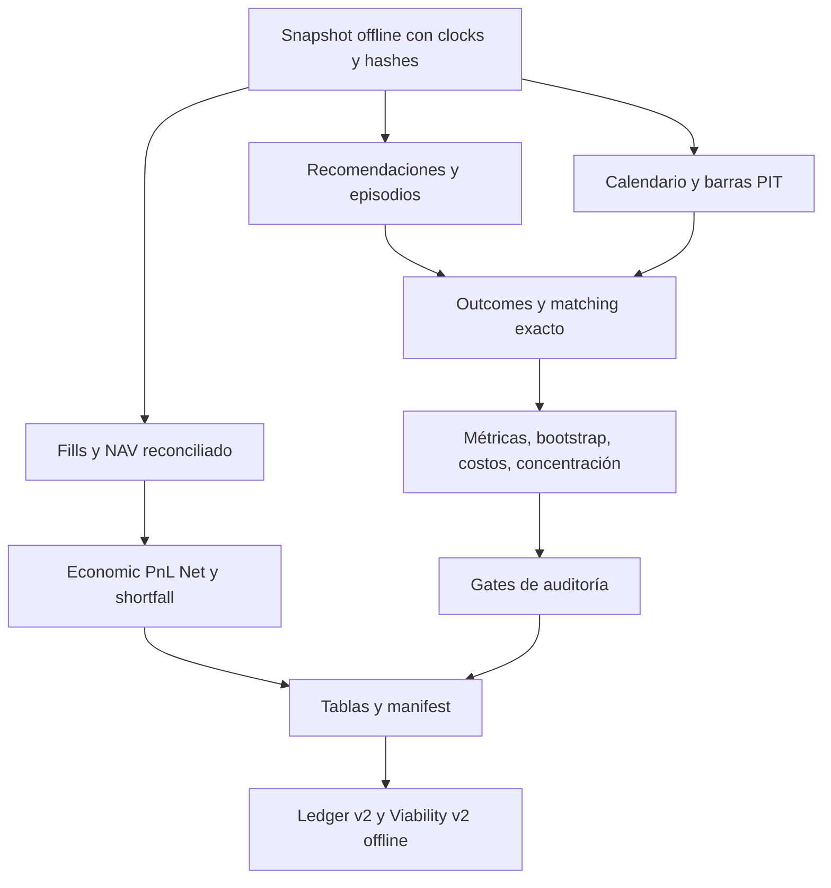

# ADR 001: Quantia Analytics v2 Measurement Contract

Fecha: 2026-09-22. Estado: implementación aditiva, auditoría offline.

## Repositorio y frontera

Esta decisión pertenece a `cocos_copilot`. Los ADR 0008/0011/0012, M12A y
`agentic_portfolio.research` citados en la propuesta pertenecen al laboratorio
Agentic Portfolio Manager, un repositorio separado. Se consultaron como
referencia; no se importan su runtime, tablas, secretos ni experimentos.
Quantia usa `src.analysis`, asyncpg y `init.sql`, no SQLAlchemy ni ese package.
Los bootstraps existentes en Quantia son IID y no cumplen este contrato;
la implementación local por bloques es necesaria para conservar el aislamiento.

No cambia decisiones, scores, estrategias, sizing, órdenes, scheduler, Telegram,
experimentos congelados ni el resultado de auditorías legacy. Los gates son
resultados de auditoría: ninguna promoción modifica autoridad operativa.

## Estimandos y unidades

| Métrica anterior | Métrica canónica | Unidad |
|---|---|---|
| PnL direccional del ledger | contrafactual bruto nominal | plan; sólo legacy |
| Ganancia de la cuenta | Economic PnL Net | cuenta, moneda, período |
| EV por fila | equal-opportunity EV neto | episodio maduro |
| Humano vs bot nominal | delta pareado bot menos humano | misma oportunidad y ventana |
| Drawdown de outcomes concatenados | diagnóstico legacy | no es capital |
| Radar | IC y EV neto OPERABLE | episodio de discovery |
| Swaps | replacement net menos original net | par contemporáneo deduplicado |

Cada input exige identidad, timestamps conscientes de zona, hash y reloj de
disponibilidad. Los archivos canónicos son snapshots explícitos, no una promesa
de que las tablas legacy contienen evidencia PIT completa. No se reconstruye
disponibilidad histórica a partir de una fecha de decisión.

## Episodios

Partición por cuenta, módulo e instrumento (incluye pareja en SWAP). La cohorte
queda fijada en el ancla: cambiar una etiqueta no crea otra oportunidad.
Se ordena por timestamp e ID, se conserva cada recomendación y su enlace.
El primer BUY/SELL fija el ancla; repeticiones no renuevan su vencimiento.
Flip, vencimiento explícito o cierre/reapertura inician otro episodio.
NEUTRAL/ABSTAIN cierran la secuencia direccional y quedan como episodios excluidos.
IDs incluyen versión y recomendación ancla, nunca un contador dependiente del
recorte histórico. IDs repetidos con contenido diferente producen error.
La ventana y score se fijan en el ancla; no se elige retrospectivamente la fila
con mejor resultado. Cambios de objetivo requieren un evento explícito versionado.

## Outcomes y costos

Entrada: apertura de próxima sesión elegible posterior a decisión; salida:
cierre de la rueda h. Calendario explícito y barras con available/ingested/sealed
no posteriores al cutoff. Revisiones se seleccionan por versión visible.
Falta de ventana futura: PENDING; falta de dato vencido: UNAVAILABLE; vínculo
ambiguo: AMBIGUOUS; política excluyente: EXCLUDED_POLICY. Nunca forward-fill.
Los retornos son fracciones; BUY = exit/entry-1, SELL = su opuesto, una apuesta
direccional teórica (no un short financiado ni una venta real).
Alpha = retorno direccional menos benchmark direccional bajo igual ventana.
IC usa score de convicción alineado y alpha futuro; benchmark faltante impide IC.

`cost-v2`: ZERO 0, CURRENT_VIABILITY 75, RESEARCH_BASE 150, STRESS 250,
SEVERE 400 bps round-trip. Retorno neto = gross - bps/10000 por exposición
direccional. NEUTRAL no paga; ABSTAIN no tiene retorno. Ningún escenario es costo
real. Break-even = gross EV*10000 sólo para una exposición round-trip.
Swaps publica costo incremental explícito de reemplazar frente a mantener;
no cancela artificialmente fricciones aplicando el mismo costo a ambas piernas.

## Economía

Economic PnL Net = NAV final - NAV inicial - flujos externos netos.
Reconciliación = realized + delta unrealized - fees - taxes - financing;
componentes brutos para evitar restar costos ya incluidos.
NAV debe provenir de posiciones reconciliadas a fills y valuaciones PIT. Se
exige evidencia de cobertura de fills, costos, flujos y valuaciones. Sin ella:
INCOMPLETE y headline null. Un snapshot scrapeado solo no satisface esto.
Shortfall monetario = -side * qty * (fill-reference), negativo si desfavorable;
se informa separado. Cambiar reference no cambia PnL. No se resta slippage otra vez.
TWR exige subperíodos valorados antes de cada flujo: no se inventa con dos NAV.
Retorno simple sobre NAV inicial sólo se publica sin flujos externos.
Turnover one-way = notional absoluto / NAV medio; exposición gross/net se calcula
con notionals reconciliados. Ratios de riesgo sólo con curva y sizing explícitos.

## Inferencia y gates

Bootstrap circular de bloques de fechas, cross-section completa, seed fija,
5.000 resamples, IC95%, bloques 20 y sensibilidad 5/10/20/40.
Si hay menos de dos bloques completos no se publica CI ni se confirma.
Test unilateral centrado bajo H0=0 con corrección Monte Carlo (1+k)/(B+1).
BH se calcula sólo en familia explícitamente congelada antes de los datos de
evaluación; hipótesis faltantes permanecen en el denominador conservador.
Exploración posterior exige nueva política/experiment_id; no se reinterpreta M12A.

`n_raw` cuenta recomendaciones elegibles representadas; `n_episodes` ventanas
maduras únicas. Clusters unen ventanas solapadas del mismo instrumento.
`n_effective` es un proxy conservador: mínimo de clusters de instrumento y
bloques temporales globales no solapados de longitud al menos el horizonte.
No es una estimación de independencia entre activos. Se publican ambos counts.
No se calcula Sharpe ni drawdown sobre el vector de trades.
Concentración usa suma de contribuciones positivas; PF de returns es diagnóstico
de notional unitario y se etiqueta, no se presenta como PF de la cuenta.
Outliers permanecen en headline; trimming/LOO son sensibilidad.

| Estado | Requisitos |
|---|---|
| IMMATURE | menos de 30 recomendaciones/episodios maduros, n_eff<20 o coverage<90% |
| OBSERVE | datos o inferencia insuficientes |
| PROVISIONAL_GUARDED | EV BASE>0, IC>0, muestra provisional, concentración sin falla |
| CONFIRMED | n_episode>=100, n_eff>=60, IC>=.03 y CI low>0, EV>=.0025 y CI low>0, stress>0, top1<=.40/top3<=.75, estabilidad>=3 períodos positivos, BH q<=.10, sensibilidad estable |
| FAIL | muestra suficiente y EV/IC o concentración incumplidos |
| DISABLED_SHADOW | SWAP por defecto; requiere revalidación explícita versionada |

Drawdown comparable, cuando existe, no debe superar 25%; su ausencia se explicita
y no valida autoridad de capital. RADAR sólo puede tener recomendación de
autoridad en OPERABLE confirmado; SWAP requiere pares y revalidación.
El reporte siempre separa resultado económico, evidencia estadística, gate y
calidad/madurez. Confirmación estadística nunca ejecuta operaciones.

## Artefactos y replay

CLI build/report/validate sin red. JSON canónico, CSV, Markdown y PNG derivados
de tablas; manifest incluye input/policy/code hashes, commit, seed, counts y
hashes de cada output. Escritura nueva o replay idéntico; conflicto no sobrescribe.
validate verifica hashes y reconstruye cálculos. El cutoff filtra inputs antes
de hashing: agregar evidencia futura no altera un run histórico.

## Dependencias y limitaciones

Se reutilizan NumPy/pandas/matplotlib ya declarados. Pydantic 2 se declara
explícitamente para contratos frozen. Sin nueva dependencia de estadística.
Integración automática de Telegram, migraciones de analytics y promoción
operativa quedan fuera de esta capa aditiva. La evidencia legacy incompleta
requiere captura prospectiva; no se resuelve inventando provenance.
