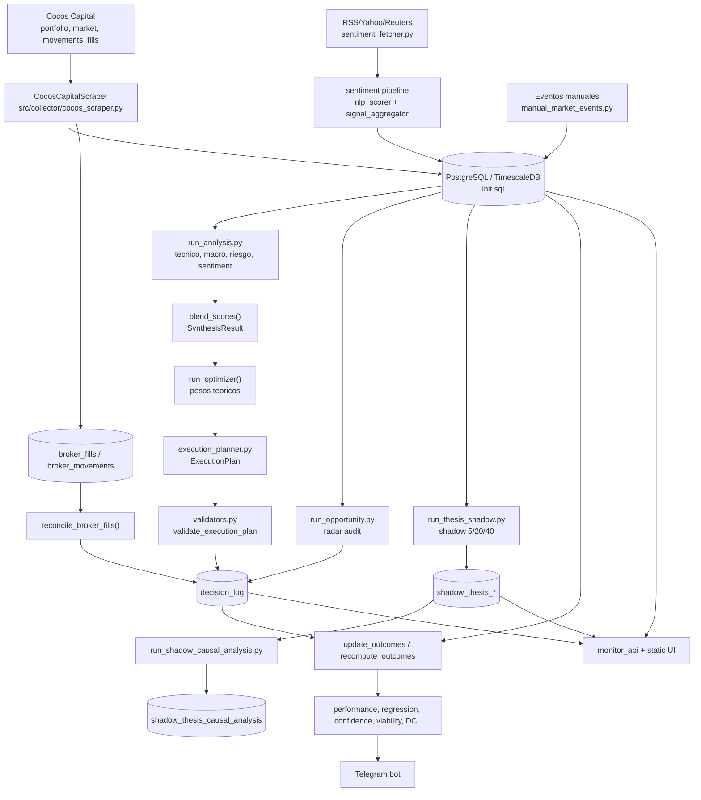

# Documento de arquitectura

## Diagrama general

## Componentes principales

| Componente | Responsabilidad | Evidencia |
|---|---|---|
| Collector | Scraping, normalizacion y persistencia de portfolio, mercado, fills y movements. | [src/collector](../src/collector), [scripts/run_once.py](../scripts/run_once.py). |
| Database | Ledger operacional e historico. | [init.sql](../init.sql), `PortfolioDatabase` en [src/collector/db.py](../src/collector/db.py). |
| Analysis | Tecnico, macro, riesgo, sentiment y synthesis. | [src/analysis](../src/analysis), [scripts/run_analysis.py](../scripts/run_analysis.py). |
| Optimizer | Pesos teoricos y rebalance report. | `run_optimizer()` en [src/analysis/optimizer.py](../src/analysis/optimizer.py). |
| Execution planner | Traduce seniales/pesos/cash a ordenes operables. | `ExecutionPlan` en [src/analysis/execution_planner.py](../src/analysis/execution_planner.py). |
| Validators | Checks duros de plan y reporte. | [src/analysis/validators.py](../src/analysis/validators.py). |
| Scheduler | Jobs de rueda y loops intradia. | [src/scheduler/runner.py](../src/scheduler/runner.py). |
| Telegram bot | Interfaz conversacional y delegacion a scripts. | [scripts/telegram_bot.py](../scripts/telegram_bot.py). |
| Monitor API | Dashboard/API read-only. | [src/monitor/api.py](../src/monitor/api.py), [src/monitor/static/index.html](../src/monitor/static/index.html). |
| Audit tools | Performance, regression, ledger, timeline, viability, confidence. | Scripts `run_*` bajo [scripts](../scripts). |

## Flujo de datos

1. Cocos y fuentes externas ingresan por scraper, backfills, sentiment y eventos
   manuales.
2. `PortfolioDatabase` escribe tablas de snapshots/precios/fills/decisiones.
3. `run_analysis.py` lee DB y construye seniales por ticker.
4. `synthesis.py` combina capas en score/confidence.
5. `optimizer.py` propone pesos teoricos.
6. `execution_planner.py` convierte teoria en plan operable, con cash, fees,
   nominales enteros, guards y funding.
7. `decision_log` guarda eventos `APPROVED`, `BLOCKED`, `EXECUTED` o
   `EXECUTED_MANUAL`.
8. Fills/movements reales actualizan o materializan ejecucion.
9. Outcomes y auditorias leen ese ledger para evaluar performance.

## Limites entre modulos

### Observa

- `CocosCapitalScraper`, `broker_fills.py`, `broker_movements.py`,
  `sentiment_fetcher.py`, scripts `backfill_*`.
- No deberian decidir compras/ventas.

### Analiza

- `technical.py`, `macro.py`, `risk.py`, `sentiment.py`, `synthesis.py`,
  `ticker_technical_report.py`.
- Produce seniales, scores, explicaciones y reportes.

### Propone

- `optimizer.py` propone targets teoricos.
- `opportunity_screener.py` y `run_opportunity.py` proponen radar/candidatos.

### Decide operabilidad

- `execution_planner.py` es el limite operativo: `DecisionIntent`,
  `OrderIntent`, `ExecutionPlan`.
- `validators.py` bloquea reportes inconsistentes.

### Ejecuta/observa ejecucion

- No hay envio automatico de ordenes confirmado.
- La ejecucion real entra por `broker_fills` y `broker_movements`.

### Audita

- `decision_ledger.py`, `decision_timeline.py`, `regression_audit.py`,
  `viability_audit.py`, `dcl/*`, monitor API.

### Shadow/audit-only

- `thesis_shadow.py` y `shadow_causal.py` viven en tablas separadas y no deben
  tocar planner.

## Dependencias externas

- Cocos Capital: broker/portfolio/mercado.
- PostgreSQL/TimescaleDB: persistencia.
- Telegram: interfaz.
- Redis: heartbeats/cache/estado efimero.
- Ollama: sentiment/causal analysis opcional.
- Fuentes RSS/Yahoo/Reuters bridge: noticias.
- TradingView/BYMA/yfinance: historia o fallback segun script.

## Decisiones de diseno relevantes

- `ExecutionPlan` como fuente de verdad del reporte operativo.
- Fills reales como fuente de verdad de ejecucion.
- `metric_scope` e `is_primary_metric` para evitar mezclar radar/debug/shadow
  con metricas operativas.
- Shadow forecasts fuera de `decision_log` en `shadow_thesis_*`.
- Logger con redaccion de secretos en [src/core/logger.py](../src/core/logger.py).
- Monitor API con `MONITOR_API_TOKEN` obligatorio.

## Tradeoffs tecnicos

- `decision_log` concentra mucha semantica. Ventaja: compatibilidad y consultas
  simples. Costo: lifecycle dificil de normalizar.
- JSONB `layers` permite evolucion rapida. Costo: contratos parciales y mas
  validacion en codigo.
- Scraping via browser permite operar sin API formal. Costo: fragilidad ante
  cambios de UI/MFA.
- Shadow separado protege el planner. Costo: mas tablas y mas explicacion al
  usuario sobre que es productivo y que no.
- Docker local-first baja costo operacional. Costo: despliegue remoto requiere
  hardening adicional.

## Incertidumbres

- No confirmado en el repo: sistema de envio de ordenes a Cocos.
- No confirmado en el repo: estrategia/versionado productivo formal para core,
  optimizer, planner y risk.
- Pendiente de validar: estado real de servicios Docker y ultima corrida.
- Pendiente de validar: soporte multiusuario end-to-end.
