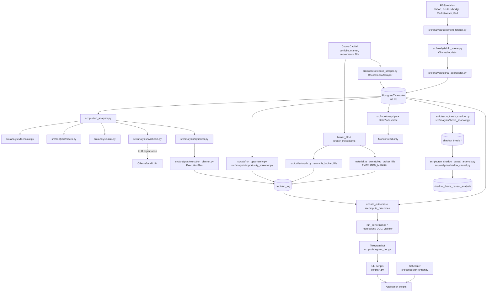

# Arquitectura actual de Quantia

## Alcance auditado

Repositorio auditado: `C:\Users\Franco\OneDrive\Escritorio\backend\cocos_copilot`.

Referencia externa usada como norte funcional: `C:\Users\Franco\Downloads\quantia_vs_claude_portfolio_report.html`, especialmente la recomendación de mantener el motor cuantitativo como autoridad de decisión y usar LLMs para extracción, crítica, explicación y conocimiento.

La auditoría es estática y documental. No cambia comportamiento productivo, no ejecuta migraciones y no toca secretos. El worktree ya tenía cambios locales en código, tests y configuración; esta etapa solo agrega documentos bajo `docs/architecture/`.

## Lectura ejecutiva

Quantia ya tiene una separación operacional real entre ingesta, análisis cuantitativo, optimizer, planner, ejecución observada, outcomes, auditorías, Telegram y monitor. La separación más importante ya existe en código:

- `scripts/run_analysis.py` orquesta cartera, macro, técnico, riesgo, sentiment, synthesis, optimizer y planner.
- `src/analysis/optimizer.py::run_optimizer` calcula pesos teóricos y expone `RebalanceReport`.
- `src/analysis/execution_planner.py::derive_decision_intents` y `reconcile_funding` transforman pesos en un `ExecutionPlan` operable.
- `src/collector/db.py::save_broker_fills`, `save_broker_movements`, `reconcile_broker_fills` y `materialize_unmatched_broker_fills` conectan fills/movimientos reales con `decision_log`.
- `src/collector/db.py::update_outcomes` y `recompute_outcomes` calculan outcomes canónicos desde `market_candles`.
- `src/analysis/audit_scope.py::classify_decision_audit_scope` separa `primary`, `planner_audit`, `radar_audit`, `blocked_audit` y `debug`.

La brecha central no es funcional sino arquitectónica: muchas entidades de lifecycle existen como columnas, `layers` JSONB o convenciones de reporte, pero no como contratos explícitos y versionados. `decision_log` es ledger, timeline parcial, outcome store, audit store y compatibilidad histórica al mismo tiempo.

## Diagrama actual

## Servicios y runtime

| Servicio | Evidencia | Responsabilidad real | Persistencia |
|---|---|---|---|
| `db` | `docker-compose.yml`, `init.sql` | Postgres/Timescale local opcional bajo perfil `localdb`. | Volumen `postgres_data`, schema en `init.sql`. |
| `scheduler` | `docker-compose.yml`, `src/scheduler/runner.py::start_scheduler` | Scraping, EOD, velas, análisis diario, outcomes, sentiment pipeline, shadow y loops intradía. | Escribe portfolio, market, broker, decisions, outcomes, preclose. |
| `telegram_bot` | `docker-compose.yml`, `scripts/telegram_bot.py::build_app` | Interfaz conversacional que llama scripts por subprocess, sincroniza cartera y muestra reportes. | Algunas acciones sincronizan portfolio/fills; otras son read-only. |
| `monitor_api` | `docker-compose.yml`, `src/monitor/api.py::create_app` | API/dashboard read-only con auth por token/TOTP opcional y logs redacted. | Lee DB, Redis y logs. No ejecuta trades. |
| Redis | `src/core/redis_client.py`, `src/scheduler/runner.py` | Heartbeats, locks blandos, cache de portfolio y deduplicación de alertas. | Estado efímero. |

## Procesos programados

`src/scheduler/runner.py::_scheduler_main` define los jobs principales:

| Job | Función | Evidencia |
|---|---|---|
| `opening_portfolio_report` | Apertura y arranque de loops intradía. | `run_opening_portfolio_report_then_start_intraday`, `_business_day_cron(hour=10, minute=31)`. |
| `post_open_portfolio_report` | Marca post apertura. | `run_post_open_portfolio_report`, 10:45 ART. |
| `preclose_alerts_1615` / `preclose_alerts_1645` | Alertas predictivas pre-cierre. | `run_preclose_alerts`, `src/analysis/preclose_alerts.py`. |
| `intraday_stop` | Detiene loops intradía. | `stop_intraday_loops`, 16:59 ART. |
| `portfolio_eod` | Scrape full EOD. | `run_full`, 17:02 ART. |
| `build_daily_candles` | Construye velas internas desde snapshots de mercado. | `run_build_daily_candles`. |
| `verify_daily_candles` | Verifica cobertura de velas. | `run_verify_daily_candles`. |
| `daily_analysis` | Ejecuta análisis formal. | `run_daily_analysis`, que llama `scripts/run_analysis.py --no-telegram`. |
| `thesis_shadow` | Corrida shadow independiente. | `run_thesis_shadow_job`, 17:18 ART. |
| `update_outcomes_daily` | Calcula outcomes. | `run_update_outcomes`, 21:30 ART. |
| `sentiment_pipeline` | Fetch, scoring y agregación de noticias. | `run_sentiment_pipeline_job`, intervalo por env. |

Los loops intradía viven en `src/scheduler/runner.py::IntradayManager`: scrape de mercado/portfolio/fills, risk guard y revalidaciones intradía. No envían órdenes.

## Entrypoints CLI y comandos

| Entrypoint | Rol real | Tablas tocadas o leídas |
|---|---|---|
| `scripts/run_once.py` | Scrape manual de portfolio, market y broker activity. | `portfolio_snapshots`, `positions`, `market_prices`, `broker_movements`, `broker_fills`. |
| `scripts/run_analysis.py` | Pipeline cuantitativo de cartera y plan operativo. | Lee portfolio/velas/sentiment; escribe `decision_log` si no corre `--no-persist`. |
| `scripts/run_opportunity.py` | Radar de oportunidades externo a cartera. | Lee universo/velas/portfolio/sentiment/shadow; persiste ideas en `decision_log` con `source='radar'` si `persist=True`. |
| `scripts/run_performance.py` | Performance, dataset operativo y lectura EV/outcomes. | Lee `decision_log`, `market_candles`, `broker_fills`. |
| `scripts/run_regression_audit.py` | Auditoría estadística por modo (`signal`, `optimizer`, `execution`, `blocked`, `all`). | Lee `decision_log`; no usa precios crudos. |
| `scripts/run_confidence_audit.py` | Salud de ingesta, velas, decisions, fills y outcomes. | Lee tablas clave. |
| `scripts/run_viability_audit.py` | Viability bot-only vs manual-only con 5/10/20/40d. | Lee `decision_log`; no cambia guards ni thresholds. |
| `scripts/run_override_audit.py` | Bot vs humano: compara planes del planner contra movimientos reales. | Lee `decision_log` y `broker_movements`. |
| `scripts/run_decision_ledger.py` | Ledger renderizado de plan, ejecución y overrides. | Usa `src/analysis/decision_ledger.py::fetch_decision_ledger`. |
| `scripts/run_policy_tree.py` | Explicación read-only del último plan formal. | Lee `decision_log.layers`, `metric_scope`, outcomes similares. |
| `scripts/run_thesis_shadow.py` | Shadow forecasts 5/20/40 y outcomes de shadow. | `shadow_thesis_runs`, `shadow_thesis_forecasts`, `shadow_thesis_outcomes`. |
| `scripts/run_shadow_causal_analysis.py` | Crítica LLM de proyecciones shadow con evidencia. | `shadow_thesis_causal_analysis`, `sentiment_raw`, `sentiment_scored`. |
| `scripts/run_sentiment_pipeline.py` | Fetch/scoring/aggregation de sentiment. | `sentiment_raw`, `sentiment_scored`, `sentiment_aggregated`. |
| `scripts/manual_market_events.py` | Carga/gestión de catalysts manuales. | `manual_market_events`. |
| `scripts/update_outcomes.py`, `scripts/recompute_outcomes.py` | Cálculo y recálculo de outcomes. | `decision_log`, `market_candles`. |
| `scripts/backfill_*`, `scripts/import_*`, `scripts/validate_byma_prices.py` | Backfills e importaciones de historia/fills/precios. | `market_candles`, `broker_fills`. |

## Telegram

`scripts/telegram_bot.py::build_app` registra comandos para cartera, análisis, radar, shadow, performance, viability, override, ledger, policy tree, confidence, calibration, settings y administración.

El bot no contiene la lógica financiera principal, pero sí contiene bastante orquestación y selección de entrypoints:

- `action_analysis`, `action_analysis_test`, `action_analysis_full`, `action_analysis_debug` llaman `scripts/run_analysis.py` con distintos flags.
- `action_radar` y `action_radar_full` llaman `scripts/run_opportunity.py`.
- `action_performance`, `action_viability`, `action_override_audit`, `action_decision_ledger`, `action_policy_tree`, `action_confidence_audit`, `action_calibration` delegan en scripts read-only.
- `action_portfolio`, `action_admin_scrape`, `action_admin_refresh_portfolio` pueden disparar sync/scrape de datos.

Riesgo actual: Telegram es presentación, pero también decide qué combinación de flags representa modo formal, test o debug. Ese contrato conviene bajarlo a application services antes de ampliar Strategy Lab.

## Monitor API

`src/monitor/api.py::create_app` expone:

| Endpoint | Función |
|---|---|
| `/api/health` | DB/Redis/estado básico. |
| `/api/ingestion` | Frescura de portfolio, market y candles. |
| `/api/candles` | Cobertura de velas. |
| `/api/decisions` | Resumen de decisiones y scopes. |
| `/api/portfolio` | Última cartera. |
| `/api/performance` | EV, win rate, fuentes, path risk y métricas del monitor. |
| `/api/override-audit` | Bot vs humano para scatter y tablas. |
| `/api/decision-ledger` | Ledger de decisiones. |
| `/api/radar-audit` | Radar teórico separado de EV operativo. |
| `/api/shadow` | Shadow forecasts/outcomes. |
| `/api/human-activity` | Actividad humana/movimientos. |
| `/api/fills` | Fills reconciliados/no reconciliados. |
| `/api/logs/recent` | Logs recientes con redacción. |

La UI `src/monitor/static/index.html` ya comunica varias separaciones sanas: radar no entra al EV operativo, shadow no modifica análisis/radar/optimizer/planner, y score cero no debe dominar calibración por defecto.

## Modelo de datos actual

| Tabla | Rol actual | Observación arquitectónica |
|---|---|---|
| `portfolio_snapshots` | Foto histórica de cartera, cash y confianza. | Tiene `snapshot_id` UUID reutilizable como `portfolio_snapshot_id`. |
| `positions` | Posiciones por snapshot. | Depende de `portfolio_snapshots.snapshot_id`. |
| `raw_snapshots` | Payload crudo de portfolio. | Útil para reproducibilidad parcial. |
| `market_prices` | Últimos precios/universo Cocos. | Snapshot implícito por timestamp; no tiene `market_snapshot_id`. |
| `market_candles` | OHLCV canónico Cocos/BYMA/internal. | Base de técnico y outcomes. No versiona fuente elegida por run salvo metadata en capas. |
| `decision_log` | Ledger central de señales, plan, bloqueos, ejecución, outcomes y scopes. | Tabla sobrecargada; contiene `run_id`, `metric_scope`, `is_primary_metric`, pero no IDs separados de lifecycle. |
| `broker_fills` | Fills reales reconciliables. | Tiene id interno, external id, fees y `decision_log_id`. |
| `broker_movements` | Movimientos Cocos de instrumentos/caja. | Fuente para fills y actividad humana; timestamps pueden ser `date_only`. |
| `ml_decision_features` | Feature store experimental. | Parcial: no parece conectado al pipeline productivo actual. |
| `ml_model_registry` | Registro experimental de modelos. | Versionado ML existe, pero no gobierna strategy/optimizer/planner/risk actuales. |
| `shadow_thesis_runs` | Corridas de shadow thesis. | Buen patrón de `run_id`, `model_version`, `schema_version`. |
| `shadow_thesis_forecasts` | Forecasts shadow por ticker/horizonte. | Tiene `feature_snapshot` JSONB y uniqueness anti-duplicación. |
| `shadow_thesis_outcomes` | Outcomes de forecasts shadow. | Separado de `decision_log`, correcto. |
| `shadow_thesis_causal_analysis` | Auditoría LLM de shadow con prompt/model/schema/fingerprint. | Mejor patrón actual para gobernanza LLM. Falta generalizarlo. |
| `sentiment_raw` | Noticias crudas con URL hash. | Base de evidence textual, pero sin `evidence_id` público. |
| `sentiment_scored` | Scoring LLM/heurístico por raw item. | Tiene model/scorer/raw_response, sin `prompt_version`. |
| `sentiment_aggregated` | Contexto agregado por ticker/scope/hora. | Entra a synthesis/radar/preclose; trazabilidad a sources JSONB. |
| `manual_market_events` | Catalysts manuales. | Bien separado; impacta guards de compras. |
| `intraday_preclose_alerts` | Alertas pre-cierre con evidence JSONB. | Capa operacional, no plan de ejecución. |

## Flujo de datos de mercado

1. `src/collector/cocos_scraper.py::CocosCapitalScraper` obtiene portfolio, mercado, fills y movements.
2. `src/collector/db.py::save_snapshot` escribe `portfolio_snapshots`, `positions`, `raw_snapshots`.
3. `src/collector/db.py::save_market_prices` escribe `market_prices`.
4. `src/collector/db.py::save_market_candles` y `build_daily_candles_from_market_prices` alimentan `market_candles`.
5. `scripts/backfill_tradingview_byma.py` y `scripts/backfill_cocos_history.py` completan historia.
6. `scripts/run_analysis.py::_load_cocos_history_frames` y `src/scheduler/runner.py::_load_canonical_history_frames` leen velas canónicas para técnico/outcomes.

La fuente de velas queda en `market_candles.source` y también se arrastra a reportes mediante metadata como `technical_candle_source_mode` y `technical_candle_source_counts`.

## Flujo de decisión actual

1. `scripts/run_analysis.py` carga portfolio y detecta stale snapshots. Si la cartera formal está stale, fuerza `no_persist=True` y `run_intent='exploratory'`.
2. Calcula macro con `src/analysis/macro.py::fetch_macro` y régimen con `get_macro_regime`.
3. Carga velas canónicas y calcula técnico con `src/analysis/technical.py::analyze_portfolio_from_frames`.
4. Calcula riesgo con `src/analysis/risk.py::build_portfolio_risk_report`.
5. Carga sentiment agregado con `src/analysis/signal_aggregator.py::load_sentiment_contexts`.
6. Combina capas con `src/analysis/synthesis.py::blend_scores`.
7. Opcionalmente enriquece explicación con `src/analysis/synthesis.py::synthesize_with_llm_local`; el LLM no modifica pesos ni plan.
8. Ejecuta `src/analysis/optimizer.py::run_optimizer`; el optimizer aplica risk gate y propone pesos.
9. `src/analysis/execution_planner.py::derive_decision_intents` y `reconcile_funding` convierten pesos en `ExecutionPlan`.
10. `src/analysis/validators.py::validate_execution_plan` valida cash, montos y consistencia.
11. `_save_execution_plan_events` persiste eventos `APPROVED` o `BLOCKED` con `source='execution_plan'`, `run_id`, `run_intent`, `decision_stage`, `metric_scope` e `is_primary_metric`.

## Flujo de ejecución

1. Cocos movements/fills entran por `CocosCapitalScraper.scrape_portfolio_movements`, `scrape_broker_fills`, `src/collector/broker_movements.py::broker_fills_from_movements` y `src/collector/broker_fills.py::broker_fills_from_cocos_payloads`.
2. `PortfolioDatabase.save_broker_movements` y `save_broker_fills` hacen upsert por `(source, external_*)` y reemplazan IDs sintéticos cuando aparece un ID real.
3. `PortfolioDatabase.reconcile_broker_fills` busca fills sin `decision_log_id` y candidatos `decision_log` con `source='execution_plan'`, `status='APPROVED'`.
4. `src/analysis/fill_reconciliation.py::choose_execution_candidate` matchea por ticker, lado, ventana temporal y gap de monto.
5. Al reconciliar, `decision_log` pasa a `status='EXECUTED'`, `metric_scope='primary'`, `is_primary_metric=TRUE`.
6. Fills no matcheados pueden materializarse como `EXECUTED_MANUAL` para separar ejecución humana de bot.

## Flujo de outcomes

`src/collector/db.py::update_outcomes`:

- usa `market_candles` como serie canónica;
- calcula `outcome_5d`, `outcome_10d`, `outcome_20d`, `outcome_40d`;
- calcula también `executable_outcome_*` cuando la referencia ejecutable difiere del precio de decisión;
- aplica la convención `src/analysis/decision_engine.py::directional_return`: BUY gana si sube, SELL gana si cae;
- marca `outcome_basis='canonical_cocos'` o `legacy_external` según compatibilidad de precio.

`scripts/run_performance.py`, `src/analysis/regression_audit.py`, `src/analysis/dcl/*` y `src/analysis/viability_audit.py` consumen estos outcomes con filtros distintos.

## Flujo de radar

`scripts/run_opportunity.py` y `src/analysis/opportunity_screener.py` evalúan universo Cocos fuera de cartera, usando técnico, macro, sentiment, cash, asimetría, edge y shadow context.

La persistencia se hace con `_save_radar_candidates`:

- `source='radar'`;
- `run_intent='scheduled_context'` en rueda o `exploratory` fuera de rueda;
- `metric_scope='radar_audit'` si aplica;
- `status='THEORETICAL'` o `BLOCKED`;
- no entra a EV principal.

## Flujo de shadow y crítica causal

`scripts/run_thesis_shadow.py` usa `src/analysis/thesis_shadow.py::build_shadow_thesis` y `ShadowThesisStore.save_theses` para crear forecasts de precio 5/20/40 en tablas propias. Este módulo no importa optimizer ni planner, y tests como `tests/test_thesis_shadow.py` verifican esa separación.

`scripts/run_shadow_causal_analysis.py` usa `src/analysis/shadow_causal.py` para construir inputs con proyección + noticias/macro, llamar Ollama con JSON schema y persistir análisis con `prompt_version`, `schema_version`, `input_fingerprint` y `raw_response`.

Este es el patrón más cercano al futuro `LLM Critic`.

## Observabilidad y auditoría

| Capa | Evidencia | Rol |
|---|---|---|
| Logger redactor | `src/core/logger.py`, `src/monitor/api.py::_redact` | Evita filtrar secretos en logs. |
| Confidence audit | `scripts/run_confidence_audit.py` | Salud de DB, prices, candles, decisions, fills. |
| Performance | `scripts/run_performance.py`, `PortfolioDatabase.get_performance_stats` | Métricas primarias con `is_primary_metric=TRUE`. |
| Regression audit | `src/analysis/regression_audit.py` | IC/regresión por modo, excluye radar/debug según modo. |
| DCL | `src/analysis/dcl/*` | Calibración experimental read-only. |
| Viability | `src/analysis/viability_audit.py` | Bot-only vs manual-only, EV neto, IC, drawdown. |
| Monitor | `src/monitor/api.py`, `src/monitor/static/index.html` | Dashboard read-only de estado, ledger, radar, shadow, fills. |

## Configuración

`src/core/config.py` centraliza `ScraperConfig`, `DatabaseConfig` y `AppConfig` desde variables de entorno. `src/core/credentials.py` cifra credenciales multiusuario. `config/market_holidays_ar.json` alimenta `src/core/market_calendar.py`.

La configuración operativa sensible está en `.env` y no debe tocarse en este refactor. Parámetros de decisión como thresholds de planner/optimizer viven hoy como constantes en módulos (`execution_planner.py`, `optimizer.py`, `risk.py`, `opportunity_screener.py`) y no están versionados por corrida.

## Tests actuales

Hay más tests en disco que los visibles por `rg --files` normal, porque `.gitignore` contiene `tests/*` con excepciones puntuales. Con `rg --files -uu tests` aparecen suites para broker fills, decision engine, execution planner, outcomes, regression, scheduler, schema, shadow, source quality, Telegram y monitor.

Tests relevantes para la arquitectura:

- Planner/cash/funding: `tests/test_execution_nominals_and_rotation.py`, `tests/test_execution_planner_cash.py`, `tests/test_cash_aware_reporting.py`.
- Outcomes/convention: `tests/test_sell_convention.py`, `tests/test_outcome_basis.py`, `tests/test_outcome_dates.py`, `tests/test_recompute_outcomes.py`.
- Regression/performance: `tests/test_regression_execution_mode.py`, `tests/test_regression_audit_render.py`, `tests/test_performance_sell_regressions.py`, `tests/test_viability_audit.py`.
- Shadow/LLM: `tests/test_thesis_shadow.py`, `tests/test_shadow_causal.py`, `tests/test_shadow_monitor.py`.
- Sentiment/source quality: `tests/test_sentiment_fetcher_sources.py`, `tests/test_source_quality_audit.py`.
- Scheduler/monitor/Telegram: `tests/test_scheduler_weekend_policy.py`, `tests/test_scheduler_canonical_history.py`, `tests/test_telegram_output_quality.py`.

La deuda no es ausencia absoluta de tests, sino que algunos quedan fuera de Git por default y no hay una matriz de pruebas por contrato arquitectónico.

