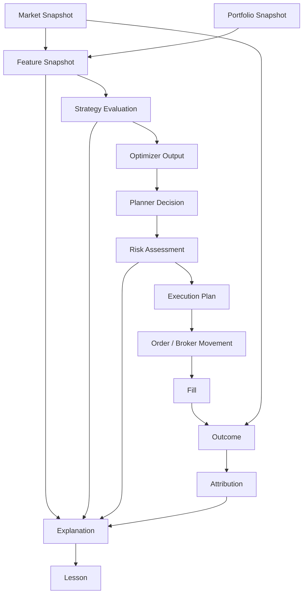
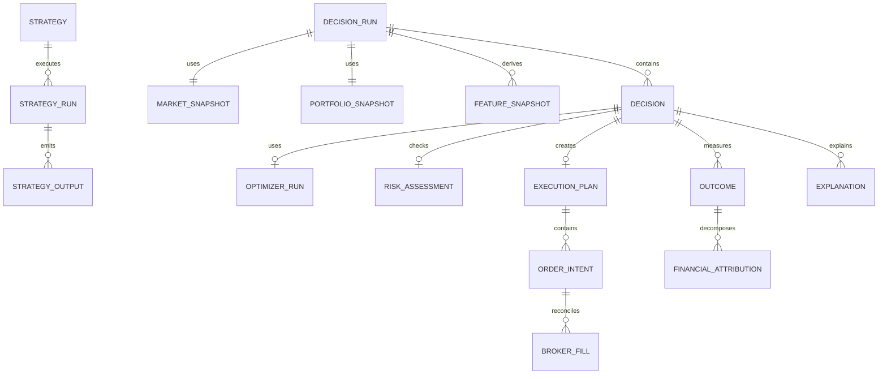

# Ciclo de vida de una decision Quantia

## Objetivo

Este documento define como deberia reconstruirse una decision de Quantia de punta a punta: desde el estado de mercado usado como input hasta el outcome, la atribucion financiera y la explicacion posterior. El objetivo no es cambiar el comportamiento productivo, sino explicitar las entidades que hoy existen de forma parcial en `decision_log`, `layers`, snapshots, fills y reportes.

La regla central es que una decision debe poder responder estas preguntas:

- Que vio el sistema.
- Que estrategia y version lo evaluo.
- Que pesos o acciones propuso.
- Que restricciones aplicaron.
- Que plan ejecutable se genero.
- Que hizo efectivamente el broker o el humano.
- Que resultado financiero produjo.
- Que explicacion queda auditada.

## Flujo objetivo



## Estado actual de identificadores

| Identificador | Estado actual | Evidencia | Problema | Recomendacion |
|---|---|---|---|---|
| `run_id` | Implementado parcialmente | `decision_log.run_id`, shadow runs | Funciona por corrida, pero no normaliza todos los subprocesos | Mantenerlo y convertirlo en raiz de `decision_runs` |
| `decision_id` | Parcial | `decision_log.id` | Es fila por ticker/evento, no entidad estable de ciclo completo | Usar `decision_log.id` como compatibilidad y sumar UUID logico |
| `strategy_id` | Ausente | Estrategia core embebida en scripts/modulos | No se puede comparar estrategias controladamente | Crear `strategy_registry.strategy_id` |
| `strategy_version` | Parcial | Shadow tiene `model_version`; live no | Los cambios de politica live no quedan trazados | Versionar core, optimizer, planner y risk |
| `market_snapshot_id` | Parcial | `market_prices.ts`, `market_candles`, `portfolio_snapshots.snapshot_id` | No hay congelamiento unico de universo/precios | Crear snapshot de mercado o vista materializable |
| `feature_snapshot_id` | Parcial | `decision_log.layers`, `ml_decision_features`, shadow `feature_snapshot` | No hay hash reproducible de inputs live | Generar hash estructurado por decision/run |
| `portfolio_snapshot_id` | Implementado | `portfolio_snapshots.snapshot_id` | Falta vinculo consistente desde decision/strategy run | Referenciarlo desde `decision_runs` |
| `optimizer_run_id` | Ausente | `OptimizationResult` queda en memoria/reportes | No se puede auditar engine/fallback/input hash | Agregar entidad o metadata versionada |
| `planner_run_id` | Parcial | `execution_plans.run_id` enlaza la corrida, pero no identifica/versiona por separado al planner | Falta version del planner por corrida | Mantener el plan persistido y sumar versionado del planner |
| `risk_assessment_id` | Ausente | Guardas en optimizer/planner/risk | Politicas de risk no se versionan | Persistir assessment estructurado |
| `execution_plan_id` | Implementado | `execution_plans.id` y `order_intents.execution_plan_id` | Falta adopcion en todas las vistas read-only | Incorporarlo gradualmente sin romper `decision_log` |
| `order_id` | Implementado para intencion | `order_intents.id` y vinculo opcional a `decision_log.id` | Todavia no enlaza fills reales | Probar reconciliacion orden-fill antes de promover el vinculo |
| `fill_id` | Implementado | `broker_fills.id` | Falta vinculo formal con orden planeada | Asociar con `order_id` o candidato reconciliado |
| `outcome_id` | Ausente/parcial | Outcomes en columnas de `decision_log`; shadow outcomes por forecast | Outcome no es entidad consultable | Crear outcome normalizado posterior |
| `attribution_id` | Ausente | No hay tabla dedicada | Resultado no se descompone por causa financiera | Crear `financial_attribution` despues de IDs |
| `explanation_id` | Parcial | `shadow_thesis_causal_analysis.id` | Explicacion live no es entidad evidence-bound | Crear explicaciones con evidence IDs |

## Modelo de relaciones recomendado



## Lectura actual del ciclo

Hoy el ciclo puede reconstruirse, pero con un servicio que conozca varias convenciones:

- `scripts/run_analysis.py` crea un `analysis_run_id`, arma layers y guarda eventos de execution plan.
- `execution_planner.py` produce `DecisionIntent`, `OrderIntent` y `ExecutionPlan`.
- `collector/db.py` persiste decisiones, fills, movimientos y outcomes.
- `fill_reconciliation.py` elige candidatos de ejecucion por ticker, side, estado, edad y monto.
- `decision_ledger.py`, `run_policy_tree.py` y el monitor reconstruyen vistas sobre `decision_log`.

La arquitectura objetivo no debe reemplazar ese flujo de golpe. Debe agregar una capa de lectura que lo normalice.

## Servicio read-only recomendado

Primer paso: `src/analysis/decision_timeline.py`.

Responsabilidades:

- Recibir filtros (`run_id`, ticker, fecha, status, source).
- Leer `decision_log`, `broker_movements`, `broker_fills`, outcomes y snapshots existentes.
- Construir eventos ordenados.
- Marcar huecos: `missing_market_snapshot_id`, `missing_strategy_id`, `missing_order_id`.
- No escribir datos.
- No modificar clasificacion productiva.

Contrato sugerido:

```python
@dataclass(frozen=True)
class DecisionTimelineEvent:
    event_id: str
    event_type: str
    ts: datetime
    ticker: str | None
    run_id: str | None
    decision_log_id: int | None
    source: str
    payload: dict[str, Any]
    gaps: list[str]
```

## Eventos minimos de timeline

| Evento | Fuente actual | Campos clave |
|---|---|---|
| `market_observed` | `market_prices`, `market_candles` | ticker, price, ts |
| `portfolio_observed` | `portfolio_snapshots`, `positions` | snapshot_id, holdings, cash |
| `features_built` | `decision_log.layers`, `ml_decision_features` | layer scores, weighted input, hash futuro |
| `signal_synthesized` | `synthesis.py`, `decision_log` | score, confidence, action |
| `weights_optimized` | `optimizer.py`, execution report | target/current/delta weights |
| `risk_checked` | planner/risk layers | guard, block reason |
| `plan_created` | `execution_plans`, `order_intents` y espejo en `decision_log` | plan ID, orden, theoretical amount, executable amount |
| `movement_detected` | `broker_movements` | side, amount, date |
| `fill_detected` | `broker_fills` | price, quantity, fees |
| `outcome_updated` | `decision_log` outcome columns | 5/10/20/40 horizon values |
| `attribution_computed` | futuro | selection, timing, costs |
| `explanation_generated` | shadow causal/futuro | evidence ids, prompt version |

## Compatibilidad con `decision_log`

`decision_log` debe seguir siendo el ledger historico. No conviene migrarlo destructivamente. La evolucion segura es:

1. Agregar metadata nueva en `layers` cuando alcance.
2. Crear vistas/servicios read-only que traduzcan filas historicas.
3. Introducir tablas nuevas solo para entidades que no entran limpiamente en columnas existentes.
4. Mantener `decision_log.id` como referencia de compatibilidad.
5. Evitar que monitor, Telegram o scripts dependan directamente de tablas nuevas hasta que haya pruebas de reconstruccion.

## Invariantes

- Una decision no puede usar datos posteriores a `decision_ts`.
- Una estrategia shadow nunca puede ejecutar ordenes.
- Una explicacion LLM no puede crear facts sin `evidence_id`.
- Un fill puede existir sin decision asociada, pero debe quedar marcado como manual/no matched.
- Un outcome debe declarar horizonte, fuente de precio y costos incluidos.
- La timeline debe poder decir "dato faltante" sin inventar entidades.

## Resultado esperado

Con este lifecycle, Quantia pasa de "ledger con mucha informacion" a "sistema de decisiones reproducibles". Eso habilita Strategy Lab, atribucion financiera, knowledge layer y explicaciones sin reescribir primero el motor core.
