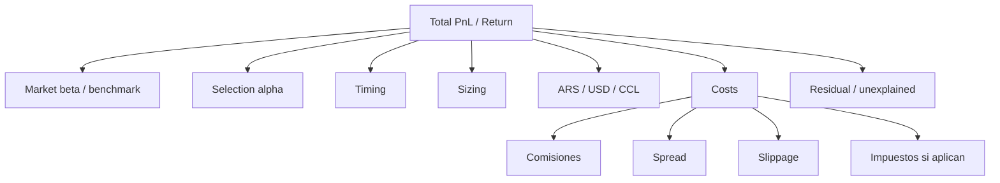

# Atribucion financiera

## Objetivo

La atribucion financiera debe explicar por que una decision gano o perdio dinero. Los outcomes actuales dicen si la direccion fue correcta en ciertos horizontes; la atribucion debe separar componentes: mercado, CCL, seleccion, timing, sizing, costos, slippage y ejecucion.

No conviene construir esto antes de estabilizar IDs de decision, plan, orden y fill. Sin esos vinculos, la atribucion queda como reporte ad hoc.

## Estado actual

| Componente | Estado | Evidencia | Brecha |
|---|---|---|---|
| Outcome por horizonte | Implementado | `collector/db.py::update_outcomes`, `run_performance.py`, `viability_audit.py` | Es direccional y por decision, no atribucion financiera completa |
| Costos estimados | Parcial | `execution_planner.py` usa fees/slippage estimados | Falta comparar contra fills reales |
| Fees reales | Parcial | `broker_fills` guarda comisiones/fees cuando existen | No siempre se enlaza a orden/plan |
| Fill reconciliation | Implementado | `fill_reconciliation.py`, `reconcile_broker_fills` | Matching limita precision intradia en algunos casos |
| CCL / macro | Parcial | `macro.py`, capas macro | No hay descomposicion persistida de retorno ARS vs USD/CCL |
| Benchmark | Parcial | Auditorias miden EV/IC; no benchmark de cartera formal | Falta retorno relativo |
| Implementation shortfall | Ausente | Plan y fill existen por separado | No se calcula plan vs ejecucion |

## Componentes de atribucion



## Metricas prioritarias

| Metrica | Uso |
|---|---|
| Return neto por decision | Resultado despues de costos |
| Benchmark-relative return | Distinguir alpha de beta |
| Buy-and-hold comparison | Evaluar si operar agrego valor |
| EV neto por horizonte | Continuar contrato de viability |
| IC | Validar ranking de score |
| Max drawdown | Controlar riesgo acumulado |
| Sortino | Penalizar downside mas que volatilidad positiva |
| Turnover | Medir friccion operativa |
| Implementation shortfall | Ver perdida entre plan y fill |
| Slippage bps | Medir calidad de ejecucion |
| Payoff ratio | Separar frecuencia de magnitud |
| Calibration by bucket | Validar score/confidence |

No es necesario implementar todos los estandares de performance al inicio. Para Quantia, la primera capa util es: benchmark-relative, costos reales/estimados, shortfall, CCL y sizing.

## Formula conceptual

Para una decision ejecutada:

```text
net_return =
  market_component
  + selection_component
  + timing_component
  + sizing_component
  + fx_ccl_component
  - fees
  - spread
  - slippage
  + residual
```

Para una decision no ejecutada:

```text
opportunity_return =
  theoretical_return
  - estimated_costs
  - risk_block_effect
```

Para un override humano:

```text
override_effect =
  manual_trade_return
  - bot_recommended_or_hold_return
  - implementation_costs
```

## Tabla sugerida

```sql
CREATE TABLE financial_attribution (
    id BIGSERIAL PRIMARY KEY,
    decision_id TEXT,
    decision_log_id BIGINT,
    execution_plan_id TEXT,
    order_id TEXT,
    fill_id BIGINT,
    ticker TEXT NOT NULL,
    horizon_days INTEGER NOT NULL,
    as_of TIMESTAMPTZ NOT NULL,
    outcome_ts TIMESTAMPTZ,
    currency TEXT NOT NULL DEFAULT 'ARS',
    gross_return DOUBLE PRECISION,
    net_return DOUBLE PRECISION,
    benchmark_return DOUBLE PRECISION,
    relative_return DOUBLE PRECISION,
    selection_component DOUBLE PRECISION,
    timing_component DOUBLE PRECISION,
    sizing_component DOUBLE PRECISION,
    fx_ccl_component DOUBLE PRECISION,
    fee_component DOUBLE PRECISION,
    spread_component DOUBLE PRECISION,
    slippage_component DOUBLE PRECISION,
    residual_component DOUBLE PRECISION,
    method_version TEXT NOT NULL,
    payload JSONB NOT NULL DEFAULT '{}'::jsonb,
    created_at TIMESTAMPTZ NOT NULL DEFAULT now()
);
```

## Benchmarks sugeridos

Empezar con pocos benchmarks y declararlos por estrategia/universo:

- Cash ARS / no-trade.
- Buy-and-hold de la posicion existente.
- Equal-weight del universo elegible.
- SPY CEDEAR o proxy de mercado global si aplica.
- Benchmark local por clase de activo cuando haya datos confiables.

Cada benchmark debe declarar:

- Fuente de precio.
- Moneda.
- Horizonte.
- Rebalance policy.
- Costos incluidos o excluidos.
- Tratamiento de feriados y datos faltantes.

## Atribucion ARS / USD / CCL

En Argentina, retorno ARS puede mezclar:

- Movimiento del subyacente.
- Movimiento del CCL.
- Brecha cambiaria.
- Liquidez/spread local.
- Efectos de precio de CEDEAR.

Separacion inicial:

```text
return_ars ~= return_underlying_usd + return_ccl + interaction + local_residual
```

No hace falta precision perfecta en v0. Si no hay datos suficientes, guardar `residual_component` y `data_quality='partial'`.

## Implementation shortfall

Para una compra:

```text
shortfall_bps = (fill_price - reference_price) / reference_price * 10000
```

Para una venta:

```text
shortfall_bps = (reference_price - fill_price) / reference_price * 10000
```

`reference_price` puede ser:

- Precio usado por planner.
- Proximo precio ejecutable.
- Close/open siguiente segun politica.

Debe guardarse `reference_price_source`.

## Fases

### Fase 1: costos y shortfall

- Vincular plan/fill cuando exista candidato.
- Calcular fees, slippage y shortfall.
- No tocar optimizer ni planner.
- Validar contra fills reales.

### Fase 2: benchmark-relative

- Crear benchmark returns por ticker/universo.
- Comparar decision vs no-trade y buy-and-hold.
- Exponer en CLI.

### Fase 3: CCL y moneda

- Persistir serie CCL usada para atribucion.
- Separar componente subyacente/CCL/residual.
- Marcar calidad de datos.

### Fase 4: decision attribution completa

- Unir selection, timing, sizing, costs y benchmark.
- Exponer en monitor.
- Alimentar explicaciones LLM evidence-bound.

## Riesgos

- Atribuir precision falsa con datos incompletos.
- Mezclar operaciones manuales con bot sin clasificacion.
- Penalizar al planner por fills que no pudo controlar.
- Confundir retorno de mercado con alpha.
- Usar precios posteriores al horizonte.
- Ignorar costos en estrategias de alto turnover.

## Regla de entrega

Toda atribucion debe incluir `method_version`, fuentes, horizonte, costos incluidos y bandera de calidad. Si no se puede explicar un componente con evidencia, debe ir a `residual_component`, no inventarse.
