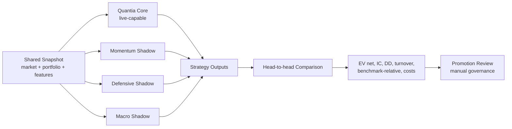

# Diseno de Strategy Lab

## Proposito

Strategy Lab debe permitir comparar estrategias alternativas contra Quantia Core bajo condiciones identicas. No es un motor nuevo de trading ni una via paralela de ejecucion productiva. Es un laboratorio shadow y reproducible para contestar una pregunta concreta: que politica habria decidido mejor con el mismo mercado, cartera, universo, capital, costos y restricciones.

La referencia `quantia_vs_claude_portfolio_report.html` propone champion-challenger, mandatos explicitos y comparacion head-to-head. En Quantia, eso debe implementarse primero como auditoria controlada, no como cambio de decision live.

## Principios

- Quantia Core sigue siendo la unica estrategia autorizada para trading live.
- Todas las estrategias reciben el mismo snapshot congelado.
- Ninguna estrategia shadow puede leer outcomes futuros.
- Las comparaciones deben usar costos netos, drawdown y turnover, no solo hit rate.
- La promocion de una estrategia requiere evidencia estadistica y operacional.
- El laboratorio no debe duplicar `scripts/run_analysis.py`; debe envolver contratos.

## Flujo objetivo



## Contratos propuestos

```python
@dataclass(frozen=True)
class StrategySpec:
    strategy_id: str
    version: str
    name: str
    mandate: str
    mode: Literal["live", "shadow", "research"]
    can_trade: bool
    universe_policy: str
    risk_policy_version: str


@dataclass(frozen=True)
class StrategyInputPacket:
    run_id: str
    as_of: datetime
    market_snapshot_id: str
    portfolio_snapshot_id: str
    feature_snapshot_id: str
    universe: list[str]
    available_cash_ars: Decimal
    cost_model_id: str
    restrictions: dict[str, Any]


@dataclass(frozen=True)
class StrategyOutputPacket:
    strategy_id: str
    strategy_version: str
    run_id: str
    ticker: str
    action: str
    score: float
    confidence: float
    target_weight: float | None
    thesis: str | None
    reasons: list[str]
    diagnostics: dict[str, Any]
```

Estos contratos pueden empezar como dataclasses internas. Si se acepta una dependencia nueva, Pydantic es util para validacion estricta y serializacion, pero no es obligatorio para el primer PR.

## Registry minimo

Tabla sugerida:

```sql
CREATE TABLE strategy_registry (
    strategy_id TEXT NOT NULL,
    version TEXT NOT NULL,
    name TEXT NOT NULL,
    mandate TEXT NOT NULL,
    mode TEXT NOT NULL,
    can_trade BOOLEAN NOT NULL DEFAULT FALSE,
    universe_policy TEXT NOT NULL,
    risk_policy_version TEXT,
    created_at TIMESTAMPTZ NOT NULL DEFAULT now(),
    retired_at TIMESTAMPTZ,
    PRIMARY KEY (strategy_id, version)
);
```

Registro inicial:

| Strategy | Mode | Can trade | Mandato |
|---|---:|---:|---|
| `quantia_core` | live | true | Motor actual: synthesis + optimizer + planner + guards |
| `price_trend_shadow` | shadow | false | Forecast price-only/context overlay existente |
| `momentum_shadow_v0` | shadow | false | Capturar continuidad de tendencia sin ejecutar |
| `defensive_shadow_v0` | shadow | false | Reducir exposicion ante riesgo/regimen debil |
| `macro_shadow_v0` | shadow | false | Evaluar sensibilidad a FX, tasas, CCL, SPY |

## Persistencia sugerida

```sql
CREATE TABLE strategy_runs (
    id BIGSERIAL PRIMARY KEY,
    run_id TEXT NOT NULL,
    strategy_id TEXT NOT NULL,
    strategy_version TEXT NOT NULL,
    market_snapshot_id TEXT,
    portfolio_snapshot_id TEXT,
    feature_snapshot_id TEXT,
    as_of TIMESTAMPTZ NOT NULL,
    mode TEXT NOT NULL,
    status TEXT NOT NULL,
    input_hash TEXT NOT NULL,
    config_hash TEXT,
    created_at TIMESTAMPTZ NOT NULL DEFAULT now()
);

CREATE TABLE strategy_outputs (
    id BIGSERIAL PRIMARY KEY,
    strategy_run_id BIGINT NOT NULL REFERENCES strategy_runs(id),
    ticker TEXT NOT NULL,
    action TEXT NOT NULL,
    score DOUBLE PRECISION,
    confidence DOUBLE PRECISION,
    target_weight DOUBLE PRECISION,
    payload JSONB NOT NULL DEFAULT '{}'::jsonb,
    created_at TIMESTAMPTZ NOT NULL DEFAULT now()
);
```

No conviene insertar estos outputs en `decision_log` al principio. `decision_log` ya mezcla ledger productivo, auditoria, outcomes y compatibilidad. Strategy Lab necesita su propio espacio shadow.

## Control de look-ahead

Reglas minimas:

- El `as_of` del packet define el corte temporal.
- Toda query de mercado debe cumplir `ts <= as_of`.
- Noticias y sentiment deben usar `published_at <= as_of` o `created_at <= as_of`.
- Outcomes solo se leen despues de guardar outputs.
- La cartera usada debe ser el snapshot anterior o igual a `as_of`, nunca posterior.
- El universo debe congelarse antes de evaluar estrategias.
- Los costos y restricciones deben ser identicos para todas las estrategias en una corrida.
- El hash de input debe cambiar si cambia cualquier feature relevante.

## Metricas de comparacion

Prioridad para Quantia:

| Metrica | Por que importa |
|---|---|
| EV neto despues de costos | Mide expectativa realista, no senal bruta |
| IC | Mide si el score ordena retornos futuros |
| Drawdown maximo | Controla supervivencia |
| Turnover | Penaliza estrategias hiperactivas |
| Payoff ratio | Separa aciertos chicos de errores grandes |
| Benchmark-relative return | Evita confundir beta de mercado con alpha |
| Implementation shortfall | Compara plan contra fill real cuando aplique |
| Calibration por bucket | Evalua si confidence/score significan algo |
| Coverage | Asegura que la estrategia no gana por decidir poco |
| Stability by regime | Detecta fragilidad ante CCL, riesgo o tendencia |

Hit rate es secundaria. Una estrategia puede tener bajo hit rate y buen EV si las ganancias compensan; tambien puede tener alto hit rate y ser mala si corta ganancias y deja correr perdidas.

## Champion-challenger

Estados:

- `candidate`: idea implementada, sin evidencia suficiente.
- `shadow`: corre regularmente sin poder operar.
- `challenger`: supera gates minimos y se compara contra core.
- `champion_review`: elegible para revision manual.
- `retired`: se apaga por baja evidencia o drift.

Criterios minimos de promocion a `challenger`:

- Muestra minima por horizonte.
- EV neto positivo despues de costos.
- IC no negativo y estable.
- Drawdown inferior al core o compensado por retorno.
- Turnover compatible con costos locales.
- Sin evidencia de look-ahead.
- Misma ventana de mercado que core.
- Reproduccion deterministica con input hash.

## Primer PR recomendado

No implementar tres estrategias nuevas de golpe. El primer PR deberia:

1. Crear registry estatico en codigo o SQL.
2. Envolver Quantia Core como `StrategySpec`.
3. Crear un runner shadow que guarde outputs de una estrategia trivial de referencia.
4. Agregar tests de igualdad de snapshot y bloqueo de `can_trade=false`.
5. Exponer un reporte CLI read-only de comparacion.

## Fuera de alcance inicial

- Cambiar thresholds live.
- Cambiar optimizer.
- Cambiar planner.
- Ejecutar estrategias shadow.
- Migrar decision_log historico.
- Crear dashboards antes de tener outputs comparables.

## Resultado esperado

Strategy Lab debe convertir las intuiciones de mejora en experimentos trazables. La ventaja no es tener mas estrategias; es poder demostrar cual politica gana, bajo que regimen, con que costo y con que riesgo.
