# Arquitectura objetivo incremental

## Principio rector

Quantia debe evolucionar hacia una plataforma cuantitativa modular, reproducible, auditable y explicable, manteniendo esta frontera:

- El motor cuantitativo calcula señales, riesgo, pesos y decisiones.
- El optimizer optimiza pesos teóricos.
- El planner transforma resultados en acciones operativas.
- Risk aplica restricciones y explica bloqueos.
- Execution registra órdenes, movimientos y fills.
- Outcome mide resultados.
- Attribution explica de dónde vino el resultado.
- El LLM extrae, critica, explica y resume.
- El LLM nunca define pesos, reemplaza optimizer/planner ni ejecuta operaciones.

La arquitectura objetivo no requiere migración masiva. El primer paso es agregar contratos alrededor de lo existente.

## Diagrama objetivo

```mermaid
flowchart TD
    subgraph Presentation
        telegram["Telegram<br/>scripts/telegram_bot.py"]
        monitor["Monitor API/UI<br/>src/monitor"]
        cli["CLI<br/>scripts/*.py"]
        reports["Reportes / dashboards"]
    end

    subgraph Application
        run_strategy["RunStrategy"]
        build_decision["BuildDecision"]
        evaluate_risk["EvaluateRisk"]
        generate_plan["GenerateExecutionPlan"]
        reconcile_exec["ReconcileExecution"]
        calc_outcome["CalculateOutcome"]
        build_attr["BuildAttribution"]
        explain["GenerateExplanation"]
        compare["CompareStrategies"]
        timeline["BuildDecisionTimeline"]
    end

    subgraph Domain
        strategy["Strategy"]
        decision_run["DecisionRun"]
        snapshots["MarketSnapshot<br/>FeatureSnapshot<br/>PortfolioSnapshot"]
        proposal["Proposal"]
        risk_assessment["RiskAssessment"]
        execution_plan["ExecutionPlan"]
        order_fill["Order / Fill"]
        outcome["Outcome"]
        attribution["Attribution"]
        explanation["Explanation"]
        lesson["Lesson"]
    end

    subgraph Infrastructure
        postgres[("Postgres/Timescale")]
        redis[("Redis")]
        cocos["Cocos provider"]
        market_data["Market data providers"]
        llm["LLM providers<br/>Ollama/local/other"]
        repos["Repositories"]
        scheduler["APScheduler"]
    end

    telegram --> build_decision
    monitor --> timeline
    cli --> run_strategy
    scheduler --> run_strategy
    scheduler --> reconcile_exec
    scheduler --> calc_outcome

    run_strategy --> snapshots
    run_strategy --> strategy
    run_strategy --> build_decision
    build_decision --> proposal
    build_decision --> evaluate_risk
    evaluate_risk --> risk_assessment
    build_decision --> generate_plan
    generate_plan --> execution_plan
    reconcile_exec --> order_fill
    calc_outcome --> outcome
    build_attr --> attribution
    explain --> explanation
    compare --> strategy
    timeline --> decision_run
    timeline --> snapshots
    timeline --> proposal
    timeline --> risk_assessment
    timeline --> execution_plan
    timeline --> order_fill
    timeline --> outcome
    timeline --> attribution
    timeline --> explanation

    cocos --> repos
    market_data --> repos
    llm --> explain
    llm --> compare
    repos --> postgres
    repos --> redis
```



## Capas objetivo adaptadas al repo

### Domain

No conviene crear un árbol de carpetas grande todavía. La capa domain puede empezar como dataclasses/enums puros bajo `src/analysis/domain.py` o módulos pequeños existentes.

Entidades objetivo:

| Entidad | Reutilización actual | Incorporación mínima |
|---|---|---|
| `Strategy` | Ausente; core está implícito. | Dataclass/interface con `strategy_id`, `version`, `mode`, `can_trade`, `evaluate()`. |
| `DecisionRun` | `decision_log.run_id`, shadow `run_id`. | Tabla `decision_runs` con trigger, intent, code/config versions. |
| `MarketSnapshot` | `market_prices.ts`, `market_candles`, source metadata. | `market_snapshot_id` que congele universo/precios usados. |
| `FeatureSnapshot` | `decision_log.layers`, `ml_decision_features`, `shadow.feature_snapshot`. | `feature_snapshot_id` + hash de features por ticker. |
| `PortfolioSnapshot` | `portfolio_snapshots.snapshot_id`. | Reutilizar como `portfolio_snapshot_id`. |
| `Proposal` | `RebalanceReport`, `DecisionIntent`. | Output estructurado de strategy antes de optimizer/planner. |
| `RiskAssessment` | `risk.py`, `risk_levels.py`, optimizer gate, planner guards. | Objeto versionado con policy version, state, blockers y evidence. |
| `ExecutionPlan` | `src/analysis/execution_planner.py::ExecutionPlan`. | Mantener; agregar `execution_plan_id` y `planner_version`. |
| `Order` | `OrderIntent`. | Convertir `OrderIntent` en entidad persistible compatible. |
| `Fill` | `BrokerFill`. | Reutilizar `broker_fills.id` como fill ID. |
| `Outcome` | `decision_log.outcome_*`, shadow outcomes. | Vista/tabla posterior para outcomes por horizon y scope. |
| `Attribution` | Ausente. | Tabla aditiva después de execution IDs. |
| `Explanation` | `synthesis.reasoning`, `shadow_causal.CausalAnalysis`. | Contract evidence-bound con model/prompt/schema versions. |
| `Lesson` | Ausente. | Derivado posterior de outcome+attribution+explanation, read-only. |

### Application

Application services deben envolver el flujo actual antes de mover lógica:

| Caso de uso | Implementación inicial compatible |
|---|---|
| `RunStrategy` | Llama el pipeline actual de `run_analysis.py` para `quantia_core_v1`; challengers usan inputs congelados y no persisten primary. |
| `BuildDecision` | Construye synthesis + proposal + optimizer output + planner plan. |
| `EvaluateRisk` | Centraliza risk assessment desde `risk.py`, `risk_levels.py`, `optimizer._get_risk_gate_state` y planner guards. |
| `GenerateExecutionPlan` | Usa `derive_decision_intents` y `reconcile_funding`. |
| `ReconcileExecution` | Envuelve `save_broker_fills`, `save_broker_movements`, `reconcile_broker_fills`. |
| `CalculateOutcome` | Envuelve `update_outcomes`/`recompute_outcomes`. |
| `BuildAttribution` | Inicialmente read-only sobre decision/fill/outcome; luego tabla. |
| `GenerateExplanation` | Usa packet estructurado + evidence IDs + LLM validator. |
| `CompareStrategies` | Compara strategy outputs con mismo snapshot/capital/costos. |
| `BuildDecisionTimeline` | Servicio read-only que reemplaza CTEs duplicadas en monitor/ledger/override. |

### Infrastructure

Se conserva el stack actual:

- Postgres/Timescale como base operacional e histórica.
- Redis para locks/heartbeats/cache.
- Cocos como broker/data provider.
- RSS/market data providers existentes.
- Telegram como presentación.
- APScheduler como scheduler.
- Ollama/local LLM como provider inicial.
- Repositories finos sobre asyncpg; no hace falta ORM.

Repositorios mínimos:

| Repositorio | Encapsula |
|---|---|
| `DecisionRunRepository` | `decision_runs`, versiones, snapshot refs. |
| `DecisionLogRepository` | Escritura compatible en `decision_log`. |
| `StrategyRunRepository` | Runs y outputs shadow/live. |
| `SnapshotRepository` | Portfolio/market/feature snapshots. |
| `ExecutionRepository` | Orders/fills/movements/reconciliation. |
| `OutcomeRepository` | Outcomes por horizon/scope. |
| `EvidenceRepository` | Noticias, snapshots y referencias estructuradas. |
| `AttributionRepository` | Attribution read/write posterior. |

### Presentation

Telegram, monitor, CLI y reportes no deberían calcular reglas nuevas. Deben llamar application services o módulos read-only compartidos.

Acciones recomendadas:

- Telegram: mantener comandos, pero mover combinaciones de flags a casos de uso.
- Monitor: consumir `decision_timeline` y `metrics` compartidos.
- CLI: mantener scripts como wrappers operativos, no como lugar de nuevas reglas.
- Reportes: leer de contratos estructurados, no de logs de texto.

## Contratos objetivo

### DecisionRun

Campos mínimos:

| Campo | Tipo | Fuente |
|---|---|---|
| `run_id` | UUID | Nuevo o reutilizado desde `decision_log.run_id`. |
| `trigger` | text | scheduler, telegram, cli, backfill. |
| `run_intent` | text | `formal_plan`, `exploratory`, `scheduled_context`, `operational_audit`. |
| `owner_chat_id` | bigint nullable | Multiusuario actual. |
| `started_at`, `finished_at` | timestamptz | Application wrapper. |
| `code_version` | text | Git commit o fallback local dirty marker. |
| `config_hash` | text | Hash de thresholds/config efectiva. |
| `market_snapshot_id` | UUID nullable | Nuevo. |
| `portfolio_snapshot_id` | UUID nullable | Reutiliza `portfolio_snapshots.snapshot_id`. |
| `status` | text | COMPLETE, PARTIAL, FAILED, DRY_RUN. |
| `metadata` | jsonb | Compatibilidad. |

### Strategy

Contrato mínimo:

```python
@dataclass(frozen=True)
class StrategySpec:
    strategy_id: str
    strategy_version: str
    mode: Literal["live", "shadow", "backtest"]
    can_trade: bool
    objective: str
    universe_policy: str
    risk_policy_version: str
    planner_version: str | None
```

Interfaz mínima:

```python
class Strategy:
    spec: StrategySpec

    def evaluate(self, packet: StrategyInputPacket) -> StrategyOutputPacket:
        ...
```

Para no reescribir, `QuantiaCoreStrategy` puede envolver las funciones actuales y devolver los outputs existentes.

### Decision Packet

Input estructurado:

- `run_id`
- `strategy_id`
- `strategy_version`
- `market_snapshot_id`
- `portfolio_snapshot_id`
- `feature_snapshot_id`
- `universe`
- `capital_base_ars`
- `cost_model_version`
- `risk_policy_version`
- `timestamp_decision`

Output estructurado:

- `decision_id`
- `proposal_id`
- `optimizer_run_id`
- `risk_assessment_id`
- `planner_run_id`
- `execution_plan_id`
- `orders[]`
- `blocked[]`
- `evidence_refs[]`
- `metric_scope`
- `can_enter_primary_metric`

## Modelo de carpetas recomendado

No crear toda esta estructura de una vez. Secuencia mínima:

```text
src/analysis/
  domain.py                    # dataclasses/enums puros mínimos
  decision_timeline.py          # read-only timeline compartida
  metrics.py                    # scopes y métricas compartidas
  strategies/
    __init__.py
    registry.py                 # StrategySpec + registry
    quantia_core.py             # wrapper del pipeline actual
    shadow_reference.py         # challenger mínimo
  repositories/
    decision_runs.py            # asyncpg fino
    strategy_runs.py            # asyncpg fino
```

Razonamiento: `src/analysis` ya es el centro del dominio cuantitativo. Separar `domain/application/infrastructure` por carpetas desde el primer día agregaría fricción sin mejorar el comportamiento.

## Evolución del schema

Fase inicial aditiva:

| Nueva tabla/vista | Propósito | Compatibilidad |
|---|---|---|
| `decision_runs` | Run-level metadata y versiones. | `decision_log.run_id` puede referenciarla luego. |
| `market_snapshots` | Congelar timestamp/universo/fuente de precios. | Se puede derivar inicialmente desde `market_prices`. |
| `market_snapshot_assets` | Precios usados por ticker en un snapshot. | No reemplaza `market_prices`. |
| `feature_snapshots` | Hash y payload de features por run/strategy/ticker. | Puede apuntar a `decision_log.layers`. |
| `strategy_registry` | Specs activas. | Una fila inicial `quantia_core`. |
| `strategy_runs` | Corridas live/shadow/backtest. | `can_trade` separa live de shadow. |
| `strategy_outputs` | Outputs por ticker/strategy/run. | No entra a EV primario salvo core live con fill. |
| `decision_timeline_view` | Vista de lectura. | Puede ser vista SQL o servicio Python. |

Fases posteriores:

| Tabla | Requisito previo |
|---|---|
| `risk_assessments` | `decision_runs`, `feature_snapshots`. |
| `optimizer_runs` | `decision_runs`, versionado optimizer. |
| `execution_plans` / `orders` | Después de estabilizar IDs sin romper `decision_log`. |
| `outcomes` normalizada | Después de mantener compat con `decision_log.outcome_*`. |
| `financial_attribution` | Después de order/fill IDs. |
| `explanations` | Después de evidence IDs y prompt governance. |
| `lessons` | Después de explanations + outcomes + attribution. |

## Reglas de compatibilidad

1. `decision_log` sigue siendo fuente productiva hasta que las nuevas tablas estén pobladas y auditadas.
2. `is_primary_metric=TRUE` sigue significando ejecución real confirmada.
3. Radar, planner audit, blocked audit, debug y shadow siguen fuera de EV primario.
4. El planner actual sigue siendo única vía para acciones operativas.
5. `broker_fills` y `broker_movements` no se renombran ni se borran.
6. `portfolio_snapshots.snapshot_id` se reutiliza; no duplicar ese concepto.
7. `shadow_thesis_*` sigue independiente; Strategy Lab no debe convertir shadow price forecasts en órdenes.
8. Monitor y Telegram no deben escribir nuevos conceptos de dominio por su cuenta.
9. Las migraciones son aditivas, con backfill opcional y rollback por feature flag.

## Estado final esperado por capacidad

| Capacidad | Contrato objetivo |
|---|---|
| Strategy Lab | `strategy_runs` con mismo snapshot/capital/costos y outputs comparables. |
| Champion-Challenger | Criterios de promoción versionados y auditables. |
| Decision Timeline | `decision_id` permite navegar datos, señales, optimizer, planner, risk, execution, outcome, attribution, explanation. |
| AI Governance | Toda salida LLM tiene evidence refs, prompt/model/schema versions, raw response, validator status. |
| Financial Attribution | Por decisión/fill se separa performance de activo, FX/CCL, costos, slippage, sizing, timing, selection. |
| Knowledge Layer | Lessons derivadas de outcomes y explanations, nunca de intuición sin evidencia. |

