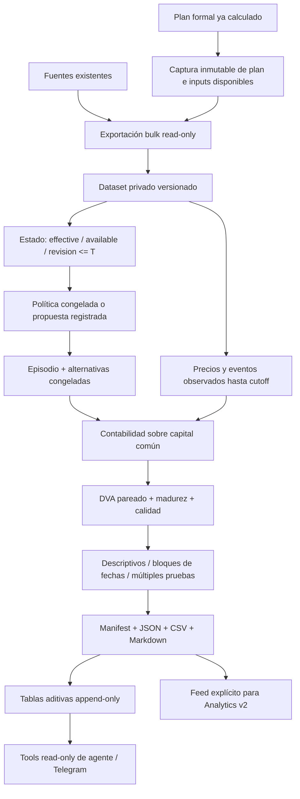

# Quantia Decision Lab / replay point-in-time

Implementación aditiva de investigación y auditoría. No envía órdenes, modifica targets,
calibra thresholds, entrena modelos ni promueve estrategias. Complementa Analytics v2;
no completa su roadmap ni convierte contrafactuales en PnL ejecutado.

## Contrato y arquitectura



Módulos en `src/decision_lab/`: contratos, estado, adapters, contrafactuales, estadística,
runner, exportación, persistencia, captura y consultas. Los cálculos son offline.
`exporter` consulta PostgreSQL en una transacción repeatable-read/read-only, sin
sincronizar outcomes ni descargar precios. No llama al pipeline productivo.

### Tres experimentos separados

| Modo | Qué afirma | Requisito |
|---|---|---|
| `RECORDED_PLAN_EVALUATION` | Evalúa una propuesta guardada, sin volver a producirla | Plan completo y cartera vinculada; versiones históricas desconocidas visibles |
| `CURRENT_POLICY_ON_HISTORICAL_DATA` | Aplica un adapter actual a inputs conocidos en T | Config e inputs explícitos, hash exacto de implementación |
| `HISTORICAL_POLICY_REPLAY` | Reejecuta una política acreditada como disponible en T | Registro `POLICY` inmutable con `registered_strategy_hash`, config, código/modelo y entrenamiento anteriores a T |

Un nombre de versión no acredita su existencia histórica. No hay un fallback desde
un replay histórico fallido a una reconstrucción moderna. Cambiar código/dependencias
invalida el registro de adapter: registrar una versión nueva o usar su runtime congelado.

Adapters disponibles: `recorded_plan_v1`, `hold_v1`, `quantia_core_v1`.
Este último reutiliza las funciones puras de technical, risk, synthesis, optimizer y
execution_planner. Su contrato es **PORTFOLIO_ONLY_NO_RADAR**: no reproduce todo el
script productivo ni escanea un universo externo. Requiere historia OHLCV alineada,
macro necesaria, universo, configuración, historia de NAV y cobertura de guards.
Rechaza huecos antes de que el optimizer pueda rellenar retornos faltantes con cero.
La única extensión al optimizer es `write_diagnostics=False`, que evita archivos
auxiliares durante el replay; el default productivo conserva su comportamiento.

### Estado y episodio

`Evidence` guarda tipo, ID, dueño cuando corresponde, `effective_at`, `available_at`,
`revision_at`, fuente, calidad y payload JSON canónico. Fechas siempre con timezone.
La elegibilidad exige los relojes de disponibilidad y revisión <= T. Las noticias
requieren además `published_at <= T`. Los anuncios de eventos futuros pueden ser
conocidos en T; sus efectos económicos sólo se aplican al volverse efectivos.

`HistoricalState` conserva IDs/hash de cartera, mercado, features, universo y referencias
completas al input seleccionado. El adapter recibe este objeto, nunca el dataset de
outcomes. Labels futuros de `decision_log` no se exportan como features.

Un `Episode` es una **oportunidad de cuenta**, con cartera inicial, capital, propuesta,
versión, costo, split y alternativas congeladas. No se replica el retorno de toda la
cartera por cada ticker del plan. `opportunity_id` no depende de la estrategia;
`episode_id` incorpora estado, plan, costos y experimento. Solicitudes duplicadas no
crean nuevas observaciones. Planes de fechas distintas pueden solaparse: se informa
esa dependencia, no se asume que sean experimentos independientes.

La comparación de versiones exige mismo estado, oportunidad, owner, modo, split,
horizonte, costos, base de retorno, timestamps, capital y HOLD. No empareja por ticker
o por proximidad temporal. Los pares faltantes se cuentan.

## Alternativas y contabilidad

Capital común: `cash_T + sum(quantity_T * mark_T)`, en ARS. Una diferencia contra el
saldo informado se conserva como diagnóstico; no se usa una base distinta por alternativa.

| Alternativa | Convención |
|---|---|
| HOLD | Conserva posiciones existentes y cash; no compra nuevamente |
| PLAN | Sólo las órdenes ejecutables/no bloqueadas congeladas; no recalcula el target |
| PARTIAL_25/50/75 | Fracción de las cantidades de PLAN, con redondeo hacia abajo al lote |
| CASH | Liquida las posiciones existentes de los tickers afectados por PLAN; resto sin cambio |
| ROTATE | Sólo una rotación con vínculos de financiación explícitos congelados |
| BEST_AVAILABLE_CANDIDATE | Ranking congelado en un universo EXACT/RECONSTRUCTED; nunca el ganador futuro |
| REAL_HUMAN_EXECUTION | `NOT_APPLICABLE` hasta contar con cobertura completa y atribución del libro real |

La fracción solicitada y la efectivamente redondeada quedan registradas. Un 50% de
una orden de tres nominales no se presenta como 1,5 nominales si el lote es uno.
Una compra que queda sin fondos al próximo open se marca `UNAVAILABLE`; no se
redimensiona silenciosamente. Se preservan también órdenes bloqueadas con cantidad
/precio nulos: no se convierten en fills cero ni invalidan las otras órdenes evaluables.

Entrada: primera sesión con **open estrictamente posterior a T**. Salida: cierre de
la sesión H de esa ventana, para 5/10/20/40 sesiones. Falta de una barra no desplaza
la ventana. El calendario BYMA existente se reutiliza y hashea; se rechazan años
no cubiertos. Convención inicial de sesión: 10:30–17:00 ART. Horarios especiales
requieren un dataset de sesiones explícito; no se inventan.

Modelo `decision-lab-ars-v1`: inicialmente 75 bps **por lado ejecutado**, sin spread,
slippage ni impuestos adicionales. Son supuestos simulados, no costos reales ni
75 bps round-trip de Viability. Cada componente es configurable en JSON y versionado.
No se recalculan las versiones históricas de costos de otros módulos.

GROSS y NET usan las mismas cantidades. El fill simulado incorpora spread/slippage;
los costos explícitos se descuentan una vez. `cost_drag=(NAV_gross-NAV_net)/capital`.
No se aplica otro descuento de slippage. El endpoint marca posiciones; no simula una
liquidación adicional al cierre. El turnover es one-way notional/capital inicial.

Cash: ARS nominal sin interés. No pretende ser neutral frente a inflación o FX.
Precios de CEDEAR en ARS ya incorporan su movimiento cambiario. Una conversión de
moneda requiere un leg explícito; `fx_bps != 0` es rechazado por este adapter ARS.

Splits/ratios conocidos al cutoff ajustan cantidades en su fecha efectiva. TOTAL_RETURN
exige cobertura de acciones corporativas y dividendos ARS completos; PRICE_ONLY informa
su exclusión. No se mezclan cantidades raw con precios ajustados: las series actualmente
ajustadas, o PIT-adjusted sin transformación explícita de base, se rechazan en el simulador.
Series legacy con ajuste UNKNOWN sólo producen evidencia exploratoria LOW.

## DVA, inferencia y calidad

`DVA_H = net_return_PLAN_H - net_return_HOLD_H`, en retorno decimal; Telegram lo muestra
en puntos porcentuales. También PLAN−CASH/ROTATE/HUMAN cuando el par es evaluable.
`regret` es el máximo ex-post **entre alternativas congeladas evaluables** menos PLAN;
se informa cobertura y nunca se usa para seleccionar candidatos en T.

Estados de outcome: MATURE, PENDING, UNAVAILABLE, INVALID, NOT_APPLICABLE. Ningún
faltante o pendiente entra como cero en EV/DVA. Los inválidos no participan ni siquiera
en el descriptivo agregado.

| Calidad | Uso |
|---|---|
| HIGH | Todas las fuentes requeridas exactas, sin supuestos/huecos; puede ser primaria |
| MEDIUM | Reconstrucción documentada; fuera de inferencia primaria en v1 |
| LOW | Aproximaciones, versiones/universo/fuentes faltantes; descriptiva explícita |
| INVALID | Evidencia de estado actual/insegura; no evalúa el plan |

Los outcomes pueden degradar la calidad del episodio por precios o acciones corporativas
no exactos. `PRIMARY` y `EXPLORATORY_ALL_ADMISSIBLE` se publican por separado; la segunda
incluye también las filas de alta calidad y **no se suma** a la primera.

Estadística por owner/strategy hash/modo/experimento/split/costo/base/horizonte:
n_raw, n elegible, fechas, n_effective, media, mediana, std muestral, cuantiles,
win rate vs HOLD, medias PLAN/HOLD, costo y turnover, contribución top1/top3,
DVA sin el mayor contribuyente. `n_effective` es el conteo greedy de ventanas de
cuenta no solapadas; es un proxy conservador, no una estimación de independencia IID.

Bootstrap circular por bloques de fechas, cross-section completa y delta pareado;
5.000 resamples, seed 42, IC95%. Bloque principal=max(20,H); mínimo 30 episodios,
dos ventanas no solapadas y al menos dos bloques de fechas. Sensibilidad 5/10/20/40
se muestra como diagnóstico, sin elegir el bloque favorable. Sólo HIGH recibe
inferencia. Un intervalo que incluye cero es INCONCLUSIVE, nunca “superioridad”.

Se reutiliza el helper numérico existente de Analytics v2, extraído a
`src/analysis/date_block_statistics.py`; su antiguo import tiene un shim compatible.
No se agrega scipy/statsmodels ni otro motor. BH conserva las hipótesis faltantes
como p=1 para el tamaño de familia. Sólo una familia declarada prospectivamente,
con estrategia congelada antes del registro, recibe q-values confirmatorios.
La nueva política no modifica M12A ni sus artefactos.

Segmentaciones por los campos congelados disponibles: tipo de decisión, score,
conviction, VIX/macro/Argentina/sector/ticker/guard/risk/radar/trend/volatility.
No se adivinan los campos ausentes: UNKNOWN no produce una comparación inventada.
`contains_ticker=MSFT` selecciona episodios de **cartera que incluyen MSFT**; no mide
alpha exclusivamente de Microsoft. Las segmentaciones son exploratorias y muestran n.
IC, Sharpe y drawdown no se calculan sobre planes multiactivo solapados: no hay
un score único ni una curva de capital continua comparable en esta población.

TRAIN/VALIDATION/HOLDOUT se congelan en Experiment y se validan sus fronteras.
`windows` genera rolling o expanding windows disjuntas. No hay fitting automático:
un modelo entrenado externamente debe registrar training_end antes de cada decisión.
Explorar thresholds después de observar resultados exige un nuevo experimento y
un holdout futuro; cambiar una etiqueta a HOLDOUT no restaura evidencia ya vista.

## Persistencia y captura prospectiva

Migración explícita: `python scripts/run_decision_lab.py migrate`.
`--dry-run` imprime el SQL. No la ejecuta `/agente` ni el cálculo offline.

Tablas nuevas: `decision_lab_objects`, `decision_lab_runs`, `decision_lab_plan_captures`.
Los objetos por hash normalizan evidencia compartida, episodios, outcomes y métricas.
Cada objeto pertenece a un owner. Triggers rechazan UPDATE/DELETE; ON CONFLICT verifica
identidad del contenido. No hay ALTER/UPDATE de tablas operativas ni cascadas.

El hook acotado de `_save_execution_plan_events` captura cartera, plan, señales,
macro/eventos presentes y hashes del código. Conserva órdenes completas antes de
que `decision_log` sea sobrescrito por otro run. Necesita owner y cartera explícitos.
Una captura fallida se registra y no cambia el plan productivo. No se obtiene una
captura histórica nueva mediante backdating: captured_at es el reloj de ingestión.
El exporter prefiere capturas inmutables y no vuelve a unirlas a filas mutables.
Aun así faltan universo completo/config/historia raw para una reejecución integral.

Artefactos privados `outputs/decision-lab/<run_id>/`:
manifest.json, inputs.json, run.json, report.md, tables/{outcomes,dva,metrics}.csv y
analytics-v2-feed.json. Hashes SHA256, políticas, runtime/dependencias, semillas,
conteos y referencias suficientes para validar/recalcular. Ningún gráfico es fuente
de verdad. Inputs y artefactos de cuentas quedan ignorados por Git.

## Comandos

Desde el checkout operativo o el worktree de la feature, con las dependencias instaladas:

```powershell
# Inspección previa; no escribe ni descarga datos.
python scripts/run_decision_lab.py export --owner 123 --from 2026-08-10T00:00:00Z --to 2026-09-23T23:59:59Z --evaluated-as-of 2026-09-24T11:00:00Z --dry-run
# Reemplazar 123 por el owner real. DATABASE_URL se obtiene del entorno, no del LLM.
python scripts/run_decision_lab.py export --owner 123 --from 2026-08-10T00:00:00Z --to 2026-09-23T23:59:59Z --evaluated-as-of 2026-09-24T11:00:00Z --legacy-single-owner --output outputs/decision-lab/exports

# Registrar adapter en ESTE runtime. --output es un archivo nuevo, no sobrescribible.
python scripts/run_decision_lab.py register --adapter recorded_plan_v1 --strategy-version recorded-production-proposal-v1 --output outputs/decision-lab/recorded-policy.json

# D y E son los archivos dataset.json/export.json de la exportación anterior.
python scripts/run_decision_lab.py run --dataset D --export-manifest E --owner 123 --evaluated-as-of 2026-09-24T11:00:00Z --experiment config/decision_lab_exploratory_v1.json --strategies outputs/decision-lab/recorded-policy.json --cost-model config/decision_lab_costs_v1.json --operation walk_forward

python scripts/run_decision_lab.py validate --folder outputs/decision-lab/RUN_ID --recompute
python scripts/run_decision_lab.py report --folder outputs/decision-lab/RUN_ID
python scripts/check_decision_lab_db.py
```

`--legacy-single-owner` sólo se admite si las fuentes verifican exactamente un owner.
No considera owner=0 o NULL un comodín. Las inferencias legacy quedan LOW.
`--no-persist` evita artefactos/DB; `--persist-db` es opt-in explícito e incompatible con
`--no-persist`. `--dry-run` inspecciona parámetros sin bootstrap ni writes.

Un episodio: `run ... --as-of <timestamp-con-zona> --plan-id <id> --portfolio-id <id>
--operation single_episode`. Rangos: `--from/--to` más `--operation date_range` o
`backfill`; todos mantienen el orden temporal. Comparación: dos archivos en
`--strategies A.json B.json --operation strategy_compare`. Una versión no implementada
falla; no se sustituye automáticamente por Quantia actual.

Ventanas: `windows --dataset D --train-sessions 60 --validation-sessions 20
--test-sessions 20 --step-sessions 20 [--expanding]`. Congelar un Experiment y una
StrategySpec por ventana; este comando no entrena ni reutiliza holdouts para calibrar.

## Telegram

Comandos existentes, sin otro bot ni ejecución de trades:

- `/agente PLAN vs HOLD 20D`
- `/agente DVA de MSFT 20D`
- `/agente ¿por qué Quantia quiere reducir Microsoft?`
- `/agente compara versiones en Decision Lab`

Tools read-only: get_decision_counterfactuals, get_decision_value_added,
get_similar_historical_episodes, compare_plan_vs_hold, compare_strategy_versions,
get_replay_evidence_quality. Leen runs ya calculados y acotados al owner autenticado;
no disparan replay, red, escritura o entrenamiento. La política del controlador exige
la herramienta correspondiente antes de cerrar. El renderizador imprime números
almacenados, n, intervalo, calidad, costo, scope y fecha; el LLM no calcula retornos.
La mecánica actual se consulta por separado y no constituye evidencia de superioridad.

## Validación y límites pendientes

Ver [auditoría de fuentes](decision-lab-source-audit.md) y
[validación y despliegue](decision-lab-validation.md).
Los tests cubren costos y capital manuales, no lookahead, futuras noticias/universos,
revisiones, split, precios ajustados, n/madurez, bootstrap/cross-section, replay/hashes,
pareamiento de versiones, ausencia de red y consultas del agente. El script PostgreSQL
prueba idempotencia, owner y rechazo de mutaciones en un schema que luego revierte.

Pendientes de datos/capacidad, no ocultos por resultados positivos:

1. Vintages históricos completos de universo/operabilidad, macro, FX, corporate actions,
   timestamps de noticias/revisiones, config y código/modelo efectivamente usados.
2. Reejecución integral de Radar/guards históricos; el adapter actual es core de cartera.
3. Libro completo de fills, flujos y corporate actions para REAL_HUMAN_EXECUTION. No se
   arma una comparación falsa usando sólo fills que resultan fáciles de vincular.
4. Soporte de más divisas, cambio explícito de base de precios ajustados, intereses,
   impuestos/financiación y cash real de broker. ARS PRICE_ONLY queda claramente etiquetado.
5. Muestra futura de alta calidad, preregistración y holdout no visto. La historia legacy
   no permite afirmar que Quantia tenga edge, aunque produzca DVA numéricos.
6. Política congelada de capital para una curva continua y ratios de riesgo comparables;
   no fabricar un Sharpe a partir de outcomes solapados.

La captura nueva evita el overwrite de evidencia futura que sí recibe. No puede recuperar
vintages que nunca se guardaron ni garantizar la veracidad de un timestamp externo.
