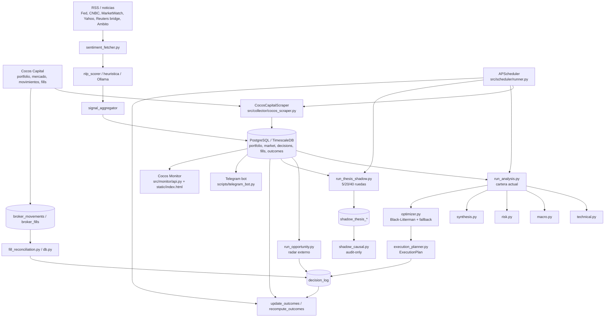

# Dossier tecnico de Quantia

Alias del proyecto: Cocos Copilot / Cocos Monitor.

Fecha de corte del relevamiento: 2026-07-30. Repo auditado: checkout principal
de `cocos_copilot`.

Este documento usa evidencia del repo, `git log`, scripts de auditoria y consultas
directas a la base viva. Cuando una fuente solicitada no estuvo disponible, queda
marcada como `[dato no verificado]` o `Pendiente de validar`.

## A. Resumen ejecutivo

Quantia es una infraestructura personal de decision accountability para una
cartera real operada en Cocos Capital. No esta documentado como un bot autonomo
de ejecucion: observa datos, analiza cartera y mercado, propone planes, bloquea
cuando faltan condiciones, registra decisiones/fills y mide outcomes. Esta
definicion esta alineada con `README.md`, `README_QUANTIA.md` y los contratos de
`src/analysis/execution_planner.py`.

El proyecto esta en produccion local con Docker Compose, PostgreSQL/TimescaleDB,
scheduler, bot de Telegram, monitor web read-only, ingestion de Cocos, radar,
shadow forecasts, sentiment contextual, pre-close alerts y auditorias de
performance. A la fecha del relevamiento, la DB viva contiene 676 filas en
`decision_log`, 183.271 velas en `market_candles`, 339 movimientos de broker,
172 fills, 2.964 snapshots de cartera, 21.549 forecasts shadow y 77 alertas
pre-close.

La conclusion principal es mixta y honesta: Quantia es un proyecto tecnicamente
serio, auditable y presentable como portfolio de Python/data/AI engineering, pero
el edge del bot todavia no esta validado estadisticamente. `run_performance.py`
reporta una muestra operativa 5D de 116 outcomes cerrados, 48% de acierto y EV
operativo +0,1%. `run_viability_audit.py` separa bot-only de manual-only y
concluye: "VIABLE COMO PROYECTO, EDGE BOT NO VALIDADO" porque bot-only 5D tiene
n=25 contra minimo 30.

La tension estrategica central sigue abierta: el nucleo actual optimiza y
rebalancea portfolio con Black-Litterman + planner operativo, mientras Franco
busca senales mas accionables tipo "compra aca / vende aca". Esa tension no es
un defecto menor: debe guiar el backlog, la narrativa publica y los proximos
experimentos.

## B. Linea de tiempo del proyecto

Reconstruida desde `git log --all --since="2026-01-01" --date=short`.

| Fecha aproximada | Hito | Evidencia |
|---|---|---|
| 2026-02-17 | Primer commit del proyecto. | `35f6ff3 first commit`. |
| 2026-02-26 a 2026-03-05 | Scraper inicial y analisis de datos scrapeados. | `f8e23d4 Ultimo update - correccion de scrapper`, `bca78b6 restructuracion y analisis de lo scrapeado`, `954e243 se modifica run_analysis`. |
| 2026-03-05 | Primer optimizador funcional. | `369b698 Ultimo release - optimizador`. |
| 2026-03-16 | Redis y cambios en Telegram bot. | `511951b agregando redis y cambios en telegram_bot`. |
| 2026-03-21 | Decision engine, TOTP automatico y UX del bot. | `5f59156 feat: decision engine, TOTP automatico...`. |
| 2026-03-21 | Traduccion de trades del optimizer a BUY/SELL ejecutables y update_outcomes diario. | `e05d690 fix: traducir trades del optimizer...`. |
| 2026-04-21 a 2026-05-03 | Monitorizacion de apertura/cierre, acciones y dashboard. | `ec76c11`, `3f54fea`, `793e791`, `2073755`. |
| 2026-05-08 | Separacion de optimizer, execution y blocked audits. | `23c5bab`, `1d1c3b9`, `ef8b5e8`, `1d89ae6`. |
| 2026-05-15 a 2026-05-16 | Velas Cocos/canonicas y lectura unificada de mercado. | `47f8ee5`, `b740229`, `a912eaa`. |
| 2026-05-25 | Expansion de auditoria operativa, BYMA history, Cocos movements como ejecucion canonica. | `15481b0`, `7ae065b`, `643e2ad`, `b9bc4b9`. |
| 2026-05-26 a 2026-05-27 | Auditoria bot vs humano, consola operativa y separacion de outcomes ejecutables. | `efe1879`, `01a76e1`, `a4d2ddf`, `2e3b5e4`. |
| 2026-06-01 a 2026-06-06 | Aislamiento de radar, actividad inferida, auditoria economica y reportes. | `6c7ccbb`, `6e2a07e`, `8a7ee27`, `768c0d8`. |
| 2026-06-30 | Consolidacion de arquitectura Quantia y motor operativo/auditorias. | `f920ba9`, `dc710b5`, `3242f3c`, `06c6be2`. |
| 2026-07-15 a 2026-07-16 | Sentiment/Ollama y prueba de narrativa Qwen revertida. | `2ab72b4`, `ed88bdb`, `ec01207`. |
| 2026-07-25 a 2026-07-28 | Decision context, broker fill audit, memo tecnico `/ticker`, documentacion completa. | `a48ca44`, `4630238`, `163ee5a`, `0da3954`, `aef5609`. |
| 2026-07-30 | Alineacion del analisis programado con el plan de Telegram y mejoras visuales del memo tecnico. | `da7ea57`, `28c5413`, `cc7a490`. |

Pivots confirmados por repo: scraper/analisis inicial hacia sistema productivo
con scheduler/Telegram/monitor; optimizer simple hacia Black-Litterman con
fallback; decision log monolitico hacia auditoria por scopes; radar/shadow como
capas separadas del EV operativo.

## C. Arquitectura tecnica actual

### Stack confirmado

| Capa | Tecnologia / evidencia |
|---|---|
| Runtime | Python, Dockerfile, `docker-compose.yml`. |
| Orquestacion | APScheduler en `src/scheduler/runner.py`; servicios `scheduler`, `telegram_bot`, `monitor_api`, `db`. |
| Persistencia | PostgreSQL/TimescaleDB (`timescale/timescaledb:latest-pg16`, `init.sql`, `asyncpg`). |
| Scraping | Playwright, requests/httpx/aiohttp, BeautifulSoup; `src/collector/cocos_scraper.py`. |
| Analitica | pandas, numpy, scipy, statsmodels, scikit-learn, `ta`, matplotlib, mplfinance. |
| Optimizacion | PyPortfolioOpt y Black-Litterman en `src/analysis/optimizer.py`; fallback explicito. |
| IA / NLP | Ollama local (`qwen2.5:3b` en `.env.example`), `nlp_scorer.py`, `sentiment_fetcher.py`, `shadow_causal.py`. |
| Interfaces | `python-telegram-bot`, aiohttp monitor API, HTML/CSS/JS estatico. |
| Estado efimero | Redis opcional para heartbeats, cache y flags. |
| Seguridad | TOTP Cocos, token/TOTP en monitor, `cryptography.Fernet` para onboarding multiusuario futuro. |

### Procesos programados confirmados

`src/scheduler/runner.py::_scheduler_main` define apertura 10:31, post-open
10:45, pre-close 16:15/16:45, stop intradia 16:59, full EOD 17:02, velas 17:05,
verificacion 17:10, analisis diario 17:12, shadow 17:18, outcomes 21:30 y
sentiment por intervalo configurable. El docstring del scheduler indica mercado
cada 90s y portfolio cada ~10 minutos dentro del loop intradia.

### Monitor y dashboard

`src/monitor/api.py::create_app` expone endpoints read-only: `/api/health`,
`/api/ingestion`, `/api/candles`, `/api/decisions`, `/api/portfolio`,
`/api/performance`, `/api/override-audit`, `/api/decision-ledger`,
`/api/radar-audit`, `/api/shadow`, `/api/human-activity`, `/api/fills` y
`/api/logs/recent`. La UI vive en `src/monitor/static/index.html`.

## D. Proceso de armado / metodologia

El repositorio muestra una construccion iterativa, no un diseno cerrado desde el
dia uno. La linea de tiempo evidencia commits pequenos con fixes productivos,
pivots de arquitectura, endurecimiento de auditoria y mejoras de UX.

Franco actua como solutions architect y owner del criterio operativo: define
fronteras, acepta o rechaza cambios, exige revisar `git diff`, separa capas
productivas de shadow/audit y mantiene la regla de no modificar scoring,
thresholds, optimizer, schemas o `decision_log` sin aprobacion explicita. Esta
metodologia esta respaldada por la memoria local de conversaciones y por docs
como `docs/architecture/AI_GOVERNANCE.md`.

Codex y Claude Code aparecen como herramientas asistidas en el pedido y en la
memoria local, pero el repo no contiene un ledger completo de prompts/handoffs
por cambio. Por lo tanto, la afirmacion fuerte verificable es: el proyecto fue
desarrollado mediante iteraciones asistidas por IA con revision humana y commits
auditables; el detalle completo de que hizo cada asistente queda pendiente de
pasar conversaciones/exportaciones si se quiere auditar caso por caso.

Practicas confirmadas:

- cambios versionados en Git con mensajes que reflejan comportamiento;
- rebuild/restart Docker para servicios modificados;
- validaciones con scripts read-only (`run_performance.py`, `run_viability_audit.py`);
- separacion explicita entre reportes, auditorias y logica productiva;
- documentacion de gaps arquitectonicos bajo `docs/architecture/`.

## E. Resultados y metricas

### Snapshot de base viva

Consulta directa a Postgres via `docker compose exec -T scheduler python -`:

| Entidad | Cantidad | Lectura |
|---|---:|---|
| `decision_log` | 676 | Ledger central de decisiones, planes, bloqueos, ejecuciones y outcomes. |
| `broker_movements` | 339 | Movimientos observados del broker. |
| `broker_fills` | 172 | Fills reales/reconciliables. |
| `portfolio_snapshots` | 2.964 | Fotos historicas de cartera. |
| `market_candles` | 183.271 | OHLCV canonico para tecnico/outcomes. |
| `shadow_thesis_forecasts` | 21.549 | Forecasts shadow 5/20/40. |
| `shadow_thesis_outcomes` | 4.701 | Outcomes shadow maduros. |
| `shadow_thesis_causal_analysis` | 0 | Tabla existe, pero sin registros en la DB relevada. |
| `manual_market_events` | 1 | Catalyst manual registrado: MU earnings. |
| `intraday_preclose_alerts` | 77 | Alertas pre-cierre persistidas. |

### Produccion desde julio 2026

`decision_log` desde 2026-07-01:

| Source / status | Cantidad | Rango |
|---|---:|---|
| `broker_movement / EXECUTED_MANUAL` | 31 | 2026-07-07 a 2026-07-29 |
| `execution_plan / APPROVED` | 35 | 2026-07-02 a 2026-07-30 |
| `execution_plan / BLOCKED` | 123 | 2026-07-01 a 2026-07-30 |
| `execution_plan / EXECUTED` | 13 | 2026-07-07 a 2026-07-27 |

### Performance operativa 90 dias

Fuente: `docker compose exec -T scheduler python scripts/run_performance.py --days 90 --no-telegram`, ejecutado el
2026-07-30 20:32 ART.

| Metrica | Valor |
|---|---:|
| Eventos totales | 639 |
| Ejecucion real confirmada | 137 eventos |
| Plan aprobado sin fill | 94 eventos |
| Senal bloqueada / guard | 260 eventos |
| Radar / idea | 139 eventos |
| Optimizer teorico | 9 eventos |
| Base operativa 5D cerrada | 116 outcomes |
| Aciertos | 48% (56 ganadoras / 60 perdedoras) |
| Ganancia promedio al acertar | +8,2% |
| Perdida promedio al fallar | -7,4% |
| EV operativo 5D | +0,1% |
| Equity curve | 100 -> 97,1 |
| Retorno acumulado | -2,9% |
| Max drawdown | -10,9% |

Interpretacion: performance operativa marginal, util como termometro, no como
prueba fuerte de edge.

### Viability bot-only vs manual-only

Fuente: `run_viability_audit.py --days 180 --no-telegram`, costo 0,75%, muestra
minima 30.

| Scope | Horizonte | n | Win | EV neto | MaxDD | IC |
|---|---:|---:|---:|---:|---:|---:|
| bot-only | 5d | 25 | 52,0% | +1,2% | -38,7% | +0,273 |
| bot-only | 10d | 24 | 58,3% | +3,2% | -39,6% | +0,391 |
| bot-only | 20d | 22 | 50,0% | +4,8% | -33,2% | +0,462 |
| manual-only | 5d | 102 | 44,1% | -0,9% | -91,9% | - |
| manual-only | 10d | 92 | 48,9% | -0,9% | -90,6% | - |
| manual-only | 20d | 85 | 45,9% | -2,0% | -97,3% | - |

Lectura oficial del script: viable como proyecto, edge bot no validado porque
bot-only 5D tiene n=25 contra minimo 30.

### Bot vs humano

Fuente: `run_override_audit.py --days 90 --no-telegram`.

| Metrica | Valor |
|---|---:|
| Planes aprobados/ejecutados | 121 |
| Intenciones unicas | 48 |
| Cerrados 5D | 106 planes / 40 intenciones |
| FOLLOWED / OVER / PARTIAL / IGNORED / OPPOSITE / PENDING_OPEN | 18 / 18 / 9 / 60 / 15 / 1 |
| Bot hipotetico 5D por plan | +0,4% |
| Delta humano vs bot 5D por plan | -0,0% |
| Bot hipotetico 5D por intencion | +1,0% |
| Delta humano vs bot 5D por intencion | -0,6% |

Interpretacion: descriptivo, no causal. Sirve para aprender donde Franco siguio,
ignoro o contradijo al sistema.

### Caso MU

Evidencia confirmada:

- `manual_market_events` tiene un evento `Micron earnings` del 2026-06-24,
  severidad `high`, politica `block_new_buys`, notas de evento binario.
- `decision_log` de julio contiene filas MU manuales y de execution plan; por
  ejemplo `2026-07-27 MU SELL EXECUTED_MANUAL`, `2026-07-27 MU SELL EXECUTED` y
  filas previas BUY/SELL con outcomes parciales.
- `run_performance.py` reporta MU con 11 trades, 36% de acierto y promedio +0,6%.

No queda confirmado en el repo, con la evidencia disponible, que el caso MU
pre-earnings sea un "caso de exito" completo en el sentido narrativo externo. Se
puede documentar como caso de evento/catalyst y trade auditado; para presentarlo
como exito hace falta el post, conversacion o ledger especifico que muestre
entrada, tesis, ejecucion, salida y outcome.

## F. Mision

Quantia existe para convertir decisiones de inversion en eventos auditables:
datos observados, hipotesis, planes, bloqueos, fills y resultados. Su objetivo no
es prometer prediccion perfecta, sino reducir decisiones opacas y medir si existe
edge operativo con evidencia.

## G. Alcance

| Hace hoy | Evidencia |
|---|---|
| Scrapea portfolio, mercado, movimientos y fills de Cocos. | `src/collector/cocos_scraper.py`, `src/scheduler/runner.py`, tablas `portfolio_snapshots`, `market_candles`, `broker_movements`, `broker_fills`. |
| Analiza cartera actual y propone un plan operativo. | `scripts/run_analysis.py`, `src/analysis/technical.py`, `macro.py`, `risk.py`, `synthesis.py`, `optimizer.py`, `execution_planner.py`. |
| Convierte pesos teoricos en nominales enteros y cash reconciliado. | `ExecutionPlan`, `derive_decision_intents`, `reconcile_funding`. |
| Bloquea/observa cuando faltan condiciones. | Estados `BLOCKED`, `WATCH`, guards en `execution_planner.py`; 123 bloqueos desde julio. |
| Genera radar externo de oportunidades. | `scripts/run_opportunity.py`, `src/analysis/opportunity_screener.py`, 139 ideas en performance 90d. |
| Genera shadow forecasts 5/20/40 audit-only. | `scripts/run_thesis_shadow.py`, tablas `shadow_thesis_*`, 21.549 forecasts. |
| Mide performance y viability separando scopes. | `run_performance.py`, `run_viability_audit.py`, `audit_scope.py`. |
| Expone Telegram y monitor web read-only. | `scripts/telegram_bot.py`, `src/monitor/api.py`, `src/monitor/static/index.html`. |

| No hace hoy | Estado |
|---|---|
| No ejecuta ordenes automaticamente en broker. | README y arquitectura lo declaran; no se encontro modulo de submit de ordenes automatico. |
| No prueba edge bot con muestra suficiente. | Viability: bot-only 5D n=25 < 30. |
| No convierte shadow forecasts en ordenes. | Docs y `run_thesis_shadow.py` lo separan de plans/portfolio/orders/decision_log. |
| No garantiza que una senal BUY/SELL sea direccion pura. | El planner mezcla rebalanceo, cash, concentracion, guards y cantidad operable. |
| No separa completamente subyacente USD, CCL y liquidez en el memo tecnico CEDEAR. | Advertencia visible en `/ticker` y `ticker_technical_report.py`. |
| No tiene Strategy Lab live/champion-challenger completo. | Diseños en `docs/architecture/STRATEGY_LAB_DESIGN.md`; no confirmado como productivo. |

Cobertura real de tickers: la DB viva muestra 299 tickers en shadow forecasts y
`market_candles` con 183.271 filas. Documentacion previa menciona radar de 313
tickers; ese numero se considera historico/documental y puede variar por corrida.

## H. Propuesta de valor

Para Franco como usuario, Quantia aporta memoria operacional: evita que una
decision quede reducida a intuicion o captura aislada. Permite reconstruir que
se vio, que plan se propuso, que se bloqueo, que hizo el humano y que resultado
maduro.

Para Franco como profesional, el diferencial es demostrar arquitectura aplicada:
Python, scraping, DB historica, scheduler, Telegram, monitor, auditoria,
optimizacion cuantitativa, IA local controlada y validacion de resultados en un
producto personal real.

Si se abriera a terceros, el valor potencial no seria "bot magico de trading",
sino decision accountability infrastructure: trazabilidad, separacion de scopes,
auditoria de overrides, calidad de datos y governance de IA. Antes de escalar a
terceros faltan multiusuario end-to-end, permisos, seguridad, backup/restore,
legal/disclaimer y una definicion clara de responsabilidad.

## I. FODA

| Cuadrante | Punto | Evidencia | Implicacion |
|---|---|---|---|
| Fortaleza | Separacion real entre analisis, optimizer, planner, fills y outcomes. | `run_analysis.py`, `optimizer.py`, `execution_planner.py`, `broker_fills`, `decision_log`, docs architecture. | Permite auditar sin confundir teoria con ejecucion. |
| Fortaleza | Operacion productiva local con scheduler, Telegram y monitor. | `docker-compose.yml`, `runner.py`, `telegram_bot.py`, `src/monitor/api.py`; servicios vivos en `docker compose ps`. | Proyecto demostrable como sistema, no solo notebook. |
| Fortaleza | Auditoria de performance con scopes. | `run_performance.py`, `run_viability_audit.py`, `audit_scope.py`. | Reduce riesgo de vender resultados inflados. |
| Fortaleza | Seguridad razonable para uso personal. | MFA Cocos, token/TOTP monitor, `.env.example`, `credentials.py`. | Base adecuada local-first; no suficiente aun para terceros. |
| Fortaleza | Pipeline sofisticado con radar, shadow, sentiment y manual events separados. | `run_opportunity.py`, `run_thesis_shadow.py`, `sentiment_fetcher.py`, `manual_market_events`. | Permite experimentar sin contaminar decisiones live. |
| Oportunidad | Convertir componentes en proyectos portfolio independientes. | Monitor, scheduler, auditoria bot-vs-humano, decision ledger, memo tecnico. | Aumenta legibilidad para recruiters sin exponer secretos. |
| Oportunidad | Strategy Lab/champion-challenger audit-only. | `docs/architecture/STRATEGY_LAB_DESIGN.md`. | Resolveria tension rebalanceo vs senales direccionales sin tocar live. |
| Oportunidad | Mejorar data quality y fallback de volumen/precios. | Caso MU con 48 velas recientes sin volumen por `internal_snapshot`. | Eleva confianza del memo y de outcomes. |
| Oportunidad | Escalar narrativa de "decision accountability". | README y memoria local favorecen framing no promocional. | Posicionamiento mas fuerte que "trading bot". |
| Debilidad | Bus factor de un solo owner. | Proyecto personal, credenciales/operacion local, decisiones en conversaciones. | Riesgo operativo y de continuidad. |
| Debilidad | Tension rebalanceo vs entrada/salida direccional. | Optimizer BL + planner actual; pedidos recurrentes de senales accionables. | Requiere backlog explicito, no ajustes ad hoc de thresholds. |
| Debilidad | `decision_log` sobrecargado. | `docs/architecture/DECISION_LIFECYCLE.md` y `CURRENT_ARCHITECTURE.md`. | Dificulta reproducibilidad completa por decision. |
| Debilidad | Cobertura de tests no totalmente clara en repo versionado. | Docs 2026-07-28 dicen 310 passed/2 skipped; relevamiento actual conto 81 archivos locales y 91 `def test_`, con `tests/` parcialmente ignorado. | Necesita baseline versionado y reproducible. |
| Debilidad | Dependencia de revision manual de cambios IA. | Regla operativa de Franco y memoria local. | Sano para control, pero limita velocidad y escalabilidad. |
| Amenaza | Fragilidad del scraping ante cambios de Cocos. | Playwright + selectores en `cocos_scraper.py`; logs/backfills historicos. | Puede degradar ingestion sin cambio de codigo financiero. |
| Amenaza | Dependencia de broker, RSS, Ollama y fuentes externas. | `.env.example`, `sentiment_fetcher.py`, `docker-compose.yml`. | Fallas externas pueden cambiar cobertura y latencia. |
| Amenaza | Overfitting entre auditorias/backtest y resultados reales. | Edge bot-only todavia n<30. | No conviene aflojar guards antes de muestra suficiente. |
| Amenaza | Tiempo limitado de Franco. | Proyecto personal paralelo [dato no verificado por repo]. | Priorizar backlog de alto impacto, no features dispersas. |

## J. Ingenieria de requerimientos

### Requisitos funcionales relevados

| ID | Requisito funcional | Componente actual | Evidencia |
|---|---|---|---|
| RF-01 | Ingestar portfolio, mercado, movimientos y fills de Cocos. | Scraper + scheduler + DB. | `src/collector/cocos_scraper.py`, `src/scheduler/runner.py`, tablas broker/portfolio/market. |
| RF-02 | Persistir historicos canonicos de precios y snapshots. | PostgreSQL/TimescaleDB. | `market_candles`, `portfolio_snapshots`, `init.sql`, `db.py`. |
| RF-03 | Analizar cartera con tecnico, macro, riesgo, sentiment y synthesis. | `scripts/run_analysis.py` + `src/analysis/*`. | Modulos `technical.py`, `macro.py`, `risk.py`, `synthesis.py`. |
| RF-04 | Optimizar pesos teoricos de cartera. | Optimizer. | `src/analysis/optimizer.py`, PyPortfolioOpt BL. |
| RF-05 | Convertir pesos en plan operable con cash, nominales, fees y guards. | Execution planner. | `src/analysis/execution_planner.py`. |
| RF-06 | Guardar planes, bloqueos, ejecuciones y manual executions. | Decision log + reconciliation. | `decision_log`, `fill_reconciliation.py`, `db.py`. |
| RF-07 | Reconciliar fills/movimientos con planes. | Broker fills/movements + reconciliation. | `broker_movements`, `broker_fills`, `reconcile_broker_fills`. |
| RF-08 | Calcular outcomes 5/10/20/40 y performance. | Outcomes + performance scripts. | `update_outcomes.py`, `run_performance.py`, `run_viability_audit.py`. |
| RF-09 | Generar radar externo y oportunidades. | Opportunity screener. | `scripts/run_opportunity.py`, `src/analysis/opportunity_screener.py`. |
| RF-10 | Ejecutar forecasts shadow audit-only. | Thesis shadow. | `scripts/run_thesis_shadow.py`, `shadow_thesis_*`. |
| RF-11 | Ingerir y puntuar sentiment contextual. | Sentiment pipeline. | `.env.example`, `sentiment_fetcher.py`, `nlp_scorer.py`, `signal_aggregator.py`. |
| RF-12 | Registrar catalysts manuales. | Manual market events. | `manual_market_events.py`, tabla `manual_market_events`. |
| RF-13 | Emitir alertas pre-cierre. | Preclose alerts. | `src/analysis/preclose_alerts.py`, tabla `intraday_preclose_alerts`. |
| RF-14 | Operar interfaz Telegram. | Telegram bot. | `scripts/telegram_bot.py`, `CommandHandler` para `/analisis`, `/radar`, `/performance`, etc. |
| RF-15 | Exponer monitor read-only. | Monitor API/UI. | `src/monitor/api.py`, `src/monitor/static/index.html`. |

### Requisitos no funcionales

| Categoria | Requisito | Estado actual | Gap |
|---|---|---|---|
| Seguridad | Credenciales fuera de Git, MFA Cocos, token/TOTP monitor. | `.env.example`, `.gitignore`, `credentials.py`, `src/monitor/api.py`. | Falta validacion formal de hardening remoto y rotacion. |
| Disponibilidad | Servicios con `restart: always`. | `docker-compose.yml`. | No confirmado backup/restore ni supervisores externos. |
| Performance | Intradia con mercado ~90s, portfolio ~10min, alertas 16:15/16:45. | `runner.py`. | No hay benchmark actual de latencia end-to-end de alerta. |
| Escalabilidad | Shadow cubre 299 tickers en DB relevada. | `shadow_thesis_forecasts`. | No confirmado limite practico por CPU/DB con >300 tickers. |
| Mantenibilidad | Modulos separados y docs extensos. | `src/analysis`, `docs/architecture`. | `decision_log` y Telegram acumulan responsabilidades. |
| Observabilidad | Health, logs recientes, performance, confidence audit. | `/api/health`, `/api/logs/recent`, scripts audit. | No confirmado alerting externo ni dashboards historicos de infra. |
| Calidad | Tests y validaciones documentadas. | `docs/testing-quality.md`, `docs/validation-2026-07-28.md`. | Baseline actual de tests no pudo ejecutarse en este relevamiento; host sin `pytest`. |

### Stakeholders

| Stakeholder | Necesidad |
|---|---|
| Franco-usuario | Decidir y revisar operaciones con disciplina, sin mezclar idea, plan y fill. |
| Franco-architect/owner | Mantener control de cambios, reglas y narrativa tecnica del sistema. |
| Reclutador tecnico / entrevistador | Entender arquitectura, stack, evidencia y madurez real del proyecto. |
| Socio/inversor potencial | Evaluar si el sistema tiene producto, data moat, riesgos y camino de validacion. |
| Futuro mantenedor | Reconstruir flujo de datos/decision y operar sin tocar thresholds indebidamente. |

### Reglas de negocio y restricciones operativas

| Regla | Evidencia |
|---|---|
| No ejecutar ordenes automaticamente. | README y ausencia de modulo de submit de ordenes. |
| ExecutionPlan es fuente operativa; optimizer es teorico. | `execution_planner.py` docstring y `optimizer.py`. |
| Fills/movimientos reales definen ejecucion observada. | `broker_fills`, `broker_movements`, `run_performance.py`. |
| Shadow/radar/audit no entran al EV principal salvo ejecucion real. | `run_performance.py`, `audit_scope.py`, `docs/07-analisis-radar-shadow.md`. |
| No cambiar pesos, thresholds, optimizer, schemas ni `decision_log` sin aprobacion explicita. | Regla operativa de Franco; memoria local. |
| Revisar `git diff` antes de rebuild/commit. | Practica operativa recurrente; no codificada como CI. |

### Supuestos actuales

| Supuesto | Riesgo |
|---|---|
| Cocos mantiene login, DOM y endpoints scrapeables. | Cambios del broker pueden romper ingestion. |
| `market_candles` es fuente canonica suficiente. | Gaps de fuente/volumen afectan tecnico/outcomes. |
| Black-Litterman es modelo adecuado para rebalanceo. | Puede producir pesos agresivos o poco accionables para entradas direccionales. |
| RSS/Ollama aportan contexto sin gobernar decisiones. | Si se mezcla con synthesis live sin evidencia, aumenta opacidad. |
| La muestra bot-only crecera sin modificar guards. | Si se cambian thresholds antes de tiempo, la auditoria pierde comparabilidad. |

### Casos de uso / historias de usuario

| ID | Historia |
|---|---|
| HU-01 | Como Franco-usuario, quiero correr `/analisis` para recibir un plan operable de mi cartera actual y entender que se compra, vende, bloquea o vigila. |
| HU-02 | Como Franco-usuario, quiero ver `/performance` para saber si las decisiones ejecutadas tienen EV positivo o si solo parecen buenas en retrospectiva. |
| HU-03 | Como Franco-usuario, quiero usar `/radar` para detectar oportunidades externas sin confundirlas con ordenes ejecutables. |
| HU-04 | Como Franco-usuario, quiero consultar `/ticker MU` para leer un memo tecnico con tesis, niveles, riesgos y advertencias de datos. |
| HU-05 | Como Franco-architect, quiero auditar bot vs humano para detectar cuando segui, ignore o contradije al sistema y que resultado tuvo. |
| HU-06 | Como futuro mantenedor, quiero reconstruir una decision desde snapshot, score, planner, fill y outcome para no depender de memoria humana. |
| HU-07 | Como lector de portfolio, quiero ver arquitectura, metricas y limites para evaluar el proyecto sin que se venda como predictor infalible. |

### Matriz de trazabilidad

| RF | Arquitectura | Datos / salida |
|---|---|---|
| RF-01, RF-02 | Scraper + scheduler + DB | `portfolio_snapshots`, `positions`, `market_prices`, `market_candles`, `broker_*`. |
| RF-03, RF-04, RF-05 | Analysis + optimizer + planner | `decision_log` con `source='execution_plan'`, Telegram `/analisis`. |
| RF-06, RF-07, RF-08 | Reconciliation + outcomes + audits | `EXECUTED`, `EXECUTED_MANUAL`, outcomes 5/10/20/40, `/performance`. |
| RF-09 | Radar | `decision_log source='radar'`, `/radar`, monitor radar audit. |
| RF-10 | Shadow | `shadow_thesis_forecasts`, `shadow_thesis_outcomes`, `/shadow`. |
| RF-11, RF-12 | Sentiment + manual events | `sentiment_*` [segun schema], `manual_market_events`, layers/context. |
| RF-13 | Preclose alerts | `intraday_preclose_alerts`, Telegram alerts. |
| RF-14, RF-15 | Interfaces | `scripts/telegram_bot.py`, `src/monitor/api.py`, monitor UI. |

### Backlog derivado

| Prioridad | Item | Motivo |
|---|---|---|
| Alta | Formalizar Strategy Lab audit-only para separar rebalanceo BL de senales direccionales. | Resuelve tension estrategica sin tocar live. |
| Alta | Crear decision timeline read-only que una decision_log, fills, movements, snapshots y outcomes. | Reduce sobrecarga de `decision_log` y mejora auditabilidad. |
| Alta | Mejorar calidad/fallback de volumen y fuentes en `market_candles` sin mezclar precios CEDEAR/ARS con externos. | Caso MU mostro gaps de 48 velas sin volumen. |
| Alta | Versionar core strategy / optimizer / planner / risk policy. | Hace comparables cambios futuros. |
| Media | Consolidar baseline de tests versionados y reproducibles. | Hoy hay divergencia entre docs historicos, tests locales y `.gitignore`. |
| Media | Persistir `optimizer_run_id` / `execution_plan_id` o metadata equivalente. | Facilita reconstruccion multiorden. |
| Media | Extender governance LLM a sentiment/synthesis con prompt_version/schema/input_hash. | `AI_GOVERNANCE.md` ya define el camino. |
| Baja | Publicar componentes como portfolio artifacts independientes. | Util para empleabilidad, no urgente para performance. |
| No hacer todavia | Aflojar thresholds/guards para aumentar operaciones. | Viability todavia no valida edge bot-only; cambiarlos contaminaria medicion. |
| No hacer todavia | Convertir shadow forecasts en ordenes live. | Shadow todavia es audit-only y sus outcomes requieren QA. |

## Vacias de informacion

| Fuente solicitada | Estado | Que hace falta |
|---|---|---|
| Post de LinkedIn del primer mes en produccion | No accesible en repo. Memoria local confirma que hubo trabajo de copy, pero no contiene el texto exacto. | Pegar link, texto o captura exportada. |
| Conversaciones completas con IA sobre diseno | Parcial: memoria local resume decisiones, pero no es transcript completo. | Exportar conversaciones relevantes o indicar thread IDs concretos. |
| Caso MU como exito pre-earnings | Parcial: hay catalyst `Micron earnings` y filas MU, pero no una narrativa completa entrada/salida/outcome. | Pasar ledger/capturas/post o definir el rango exacto del trade. |
| Latencia real de alertas pre-close | No medida en este relevamiento. | Logs de alert_ts vs envio Telegram o instrumentacion. |
| Seguridad remota/Tailscale/monitor publico | Parcial en docs y memoria; no auditado ahora. | ACL actual, configuracion firewall/Tailscale y resultado de prueba externa. |
| Backup/restore de DB | No confirmado. | Script o evidencia de restore probado. |
| CI/CD | No confirmado en repo. | Workflows, si existen fuera del checkout. |
| Multiusuario end-to-end | Parcial en config/codigo, no validado como producto. | Prueba con usuario secundario y credenciales cifradas. |

## Fuentes relevadas

- `README.md`, `README_QUANTIA.md`, `docs/00-indice.md`, `docs/architecture/*`.
- `docker-compose.yml`, `Dockerfile`, `.env.example`, `requirements.txt`.
- `src/scheduler/runner.py`, `scripts/telegram_bot.py`, `src/monitor/api.py`.
- `scripts/run_analysis.py`, `scripts/run_opportunity.py`,
  `scripts/run_performance.py`, `scripts/run_viability_audit.py`,
  `scripts/run_override_audit.py`, `scripts/run_ticker_analysis.py`.
- `src/analysis/optimizer.py`, `execution_planner.py`, `audit_scope.py`,
  `thesis_shadow.py`, `sentiment_fetcher.py`, `shadow_causal.py`.
- Consultas directas a Postgres via `docker compose exec -T scheduler python -`.
- Salidas runtime de `run_performance.py`, `run_viability_audit.py`,
  `run_override_audit.py`.
- `git log --all --since="2026-01-01" --date=short`.
- Memoria local Codex para contexto de conversaciones/proceso; usada solo donde
  se indica como no-repo o como preferencia historica.
